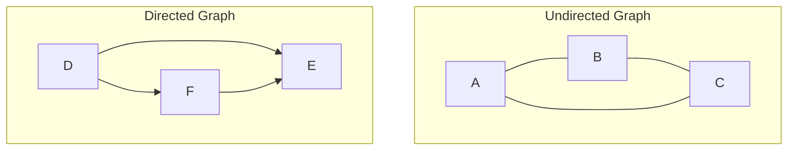
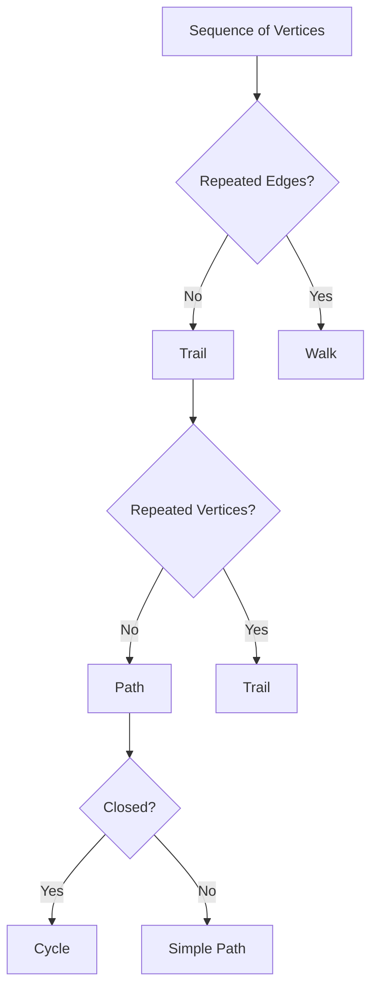
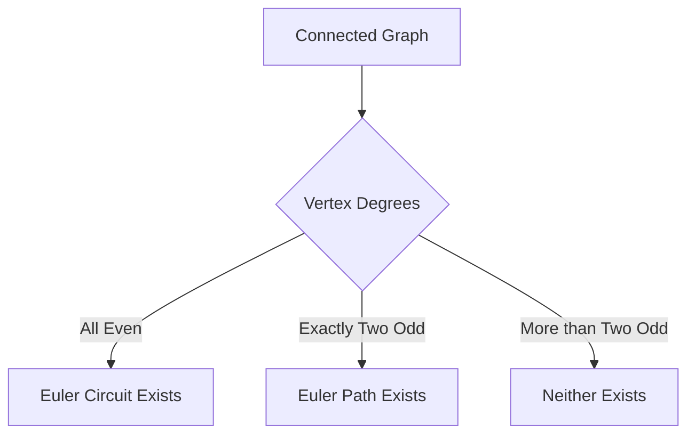
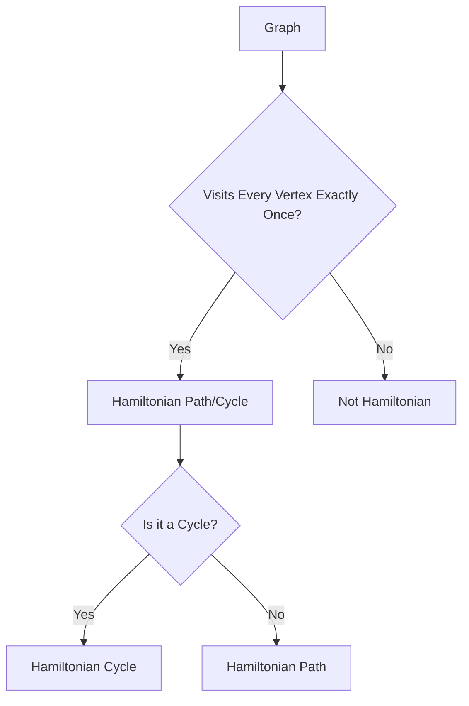
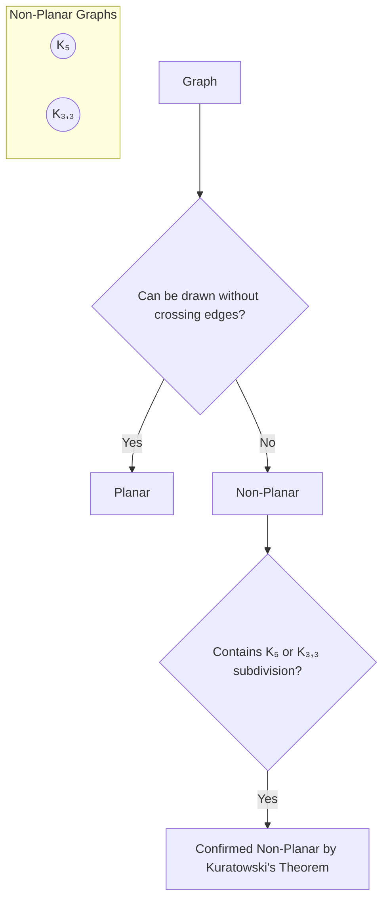

# Graph Theory: Complete Study Notes

## 1. Fundamental Concepts of Graphs

### Definition of a Graph
A graph `G` is a pair `(V, E)` where:
- `V` is a set of **vertices** (or nodes).
- `E` is a set of **edges** that connect pairs of vertices.

### Types of Graphs

#### Undirected Graphs
Edges are unordered pairs of vertices `{u, v}`. The edge `(u, v)` is identical to `(v, u)`. They are used to model symmetric relationships.

#### Directed Graphs (Digraphs)
Edges are ordered pairs of vertices `(u, v)`, representing a one-way connection from `u` (the tail) to `v` (the head).



## 2. Graph Terminology

### Adjacency, Neighborhood, and Degree
- **Adjacent Vertices**: Two vertices are **adjacent** if they are connected by an edge.
- **Neighborhood `N(v)`**: The set of all vertices adjacent to a vertex `v`.
- **Degree `deg(v)`**: The number of edges incident to a vertex `v`. In a digraph, we distinguish between:
  - **In-degree `deg⁻(v)`**: Number of incoming edges.
  - **Out-degree `deg⁺(v)`**: Number of outgoing edges.
  - `deg(v) = deg⁻(v) + deg⁺(v)`

### Handshaking Theorem
For any undirected graph, the sum of the degrees of all vertices is equal to twice the number of edges.
$$ \sum_{v \in V} \deg(v) = 2|E| $$
This implies that the number of vertices with an odd degree must be even.

```mermaid
graph LR
    A[Vertex v] --> B{deg(v) = ?}
    B --> C[Sum of incident edges]
    subgraph Directed Graph
        D[deg⁻(v)]
        E[deg⁺(v)]
        C --> D & E
    end
```

## 3. Paths, Trails, and Walks

- **Walk**: A sequence of vertices and edges `v₀, e₁, v₁, e₂, ..., eₖ, vₖ` where each edge `eᵢ` connects `vᵢ₋₁` and `vᵢ`. Edges and vertices can be repeated.
- **Trail**: A walk where no edge is repeated.
- **Path**: A trail where no vertex is repeated (except possibly the start and end vertices).

## 4. Cycles and Circuits

- **Circuit**: A closed trail (starts and ends at the same vertex) where no edge is repeated.
- **Cycle**: A circuit where no intermediate vertex is repeated. It's a path that starts and ends at the same vertex.



## 5. Euler Paths and Circuits

### Definitions
- **Euler Trail/Path**: A trail that visits every edge of the graph exactly once.
- **Euler Circuit/Cycle**: An Euler trail that is a circuit (starts and ends at the same vertex).

### Euler's Theorem
For a connected, undirected graph:
- An **Euler circuit** exists if and only if every vertex has an **even degree**.
- An **Euler path** exists if and only if there are **exactly two vertices of odd degree**. These two vertices will be the start and end points of the path.

The famous **Königsberg Bridge Problem** was solved by Euler using this theorem, marking the birth of graph theory. The city's layout had four landmasses connected by seven bridges, which translated to a graph with four vertices of odd degrees (3, 3, 3, 5), thus having no Euler circuit or path.



## 6. Hamiltonian Paths and Cycles

### Definitions
- **Hamiltonian Path**: A path that visits every vertex of the graph exactly once.
- **Hamiltonian Cycle**: A Hamiltonian path that is a cycle (starts and ends at the same vertex, forming a loop through all vertices).

### Properties
- Unlike Euler paths, there is no simple necessary and sufficient condition for the existence of Hamiltonian paths/cycles.
- Finding a Hamiltonian cycle is an **NP-complete problem**, meaning it is computationally hard to solve for large graphs.
- **Dirac's Theorem (Sufficient Condition)**: If a graph `G` with `n ≥ 3` vertices has a minimum degree `δ(G) ≥ n/2`, then `G` has a Hamiltonian cycle.



## 7. Planar Graphs

### Definition
A graph is **planar** if it can be drawn on a plane without any edges crossing each other. Such a drawing is called a **planar representation**.

### Euler's Formula for Planar Graphs
For any connected planar graph with `v` vertices, `e` edges, and `f` faces (regions bounded by edges, including the outer unbounded region):
$$ v - e + f = 2 $$

### Kuratowski's Theorem
A graph is non-planar if and only if it contains a subgraph that is a **subdivision** of `K₅` (the complete graph with 5 vertices) or `K₃,₃` (the complete bipartite graph with two sets of 3 vertices).



## 8. Graph Isomorphism

### Definition
Two graphs `G₁ = (V₁, E₁)` and `G₂ = (V₂, E₂)` are **isomorphic** if there exists a bijection (a one-to-one correspondence) `f: V₁ → V₂` such that any two vertices `u` and `v` in `V₁` are adjacent if and only if `f(u)` and `f(v)` are adjacent in `G₂`.

In simple terms, two graphs are isomorphic if they are structurally identical, even if they are drawn differently.

### Invariants
Properties that must be the same in isomorphic graphs:
- Same number of vertices.
- Same number of edges.
- Same degree sequence (the list of degrees of all vertices).

## 9. Topological Sort

### Definition
A **topological sort** or **topological ordering** of a directed acyclic graph (DAG) is a linear ordering of its vertices such that for every directed edge from vertex `u` to vertex `v`, `u` comes before `v` in the ordering.

### Algorithm (Kahn's Algorithm)
1. Compute the in-degree for every vertex.
2. Initialize a queue with all vertices having an in-degree of 0.
3. While the queue is not empty:
   a. Dequeue a vertex `u`. Add `u` to the topological order.
   b. For each neighbor `v` of `u`:
      i. Decrement the in-degree of `v`.
      ii. If the in-degree of `v` becomes 0, enqueue `v`.
4. If the topological order contains all vertices, the sort is successful. Otherwise, the graph has a cycle.

```mermaid
graph TD
    A[Start] --> B{Find vertices with in-degree 0};
    B --> C[Add to queue];
    C --> D{Queue empty?};
    D -- No --> E[Dequeue vertex u];
    E --> F[Add u to sorted list];
    F --> G[For each neighbor v of u];
    G --> H{Decrement in-degree of v};
    H --> I{in-degree of v == 0?};
    I -- Yes --> J[Enqueue v];
    J --> G;
    I -- No --> G;
    G -- All neighbors processed --> D;
    D -- Yes --> K[End];
