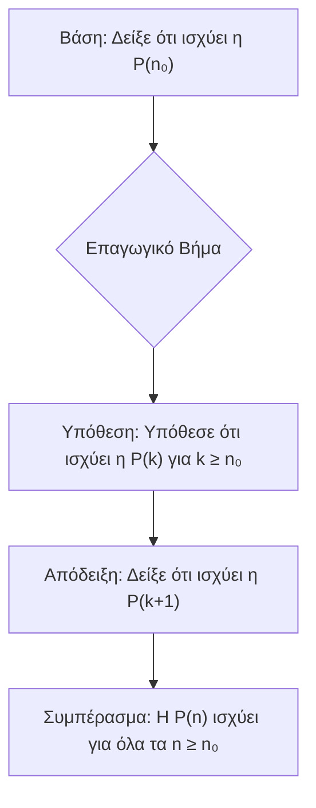
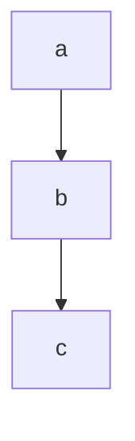
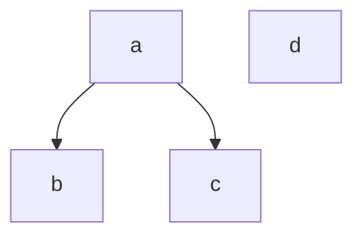

---

## **Κεφάλαιο 0: Μαθηματική Επαγωγή**

### **Θεωρητικό Υπόβαθρο**

Η **αρχή της μαθηματικής επαγωγής** είναι một ισχυρή αποδεικτική τεχνική που χρησιμοποιείται για να αποδειχθεί ότι μια πρόταση $P(n)$ ισχύει για όλους τους φυσικούς αριθμούς $n$ που είναι μεγαλύτεροι ή ίσοι με έναν αρχικό αριθμό $n_0$.

Η απόδειξη με μαθηματική επαγωγή αποτελείται από δύο βασικά βήματα:

1.  **Βάση της Επαγωγής (Base Case):**
	    Δείχνουμε ότι η πρόταση $P(n)$ ισχύει για την αρχική τιμή $n = n_0$. Αυτό το βήμα είναι θεμελιώδες, καθώς αποτελεί το "πρώτο ντόμινο" που πέφτει.

2.  **Επαγωγικό Βήμα (Inductive Step):**
    Αποτελείται από δύο μέρη:
    *   **Επαγωγική Υπόθεση (Inductive Hypothesis):** Υποθέτουμε ότι η πρόταση $P(k)$ ισχύει για έναν τυχαίο, αυθαίρετο ακέραιο $k \ge n_0$.
    *   **Επαγωγικό Συμπέρασμα (Inductive Conclusion):** Χρησιμοποιώντας την επαγωγική υπόθεση, αποδεικνύουμε ότι η πρόταση ισχύει και για τον επόμενο ακέραιο, δηλαδή ότι ισχύει η $P(k+1)$.

Αν και τα δύο αυτά βήματα ολοκληρωθούν επιτυχώς, τότε σύμφωνα με την αρχή της μαθηματικής επαγωγής, η πρόταση $P(n)$ ισχύει για κάθε ακέραιο $n \ge n_0$.

---

### **Λύσεις Ασκήσεων**

#### **Άσκηση 0.1**
Δείξτε ότι για κάθε $n \ge 1$ ισχύει η ακόλουθη ισότητα:
$$ 1^2 + 2^2 + 3^2 + \dots + n^2 = \frac{n(n + 1)(2n + 1)}{6} $$

**Λύση:**

Έστω $P(n)$ η πρόταση: $\sum_{i=1}^{n} i^2 = \frac{n(n + 1)(2n + 1)}{6}$.

1.  **Βάση της Επαγωγής (για $n=1$):**
    *   Αριστερό μέλος: $1^2 = 1$.
    *   Δεξιό μέλος: $\frac{1(1 + 1)(2 \cdot 1 + 1)}{6} = \frac{1 \cdot 2 \cdot 3}{6} = \frac{6}{6} = 1$.
    *   Αφού $1=1$, η πρόταση $P(1)$ ισχύει.

2.  **Επαγωγικό Βήμα:**
    *   **Επαγωγική Υπόθεση:** Υποθέτουμε ότι η $P(k)$ ισχύει για κάποιον ακέραιο $k \ge 1$. Δηλαδή, υποθέτουμε ότι:
        $$ 1^2 + 2^2 + \dots + k^2 = \frac{k(k + 1)(2k + 1)}{6} $$
    *   **Επαγωγικό Συμπέρασμα:** Θα δείξουμε ότι ισχύει η $P(k+1)$, δηλαδή:
        $$ 1^2 + 2^2 + \dots + k^2 + (k+1)^2 = \frac{(k+1)((k+1) + 1)(2(k+1) + 1)}{6} $$
        $$ 1^2 + 2^2 + \dots + k^2 + (k+1)^2 = \frac{(k+1)(k + 2)(2k + 3)}{6} $$

    Ξεκινάμε από το αριστερό μέλος της $P(k+1)$ και χρησιμοποιούμε την επαγωγική υπόθεση:
    $$ (1^2 + 2^2 + \dots + k^2) + (k+1)^2 = \left( \frac{k(k + 1)(2k + 1)}{6} \right) + (k+1)^2 $$
    Βγάζουμε κοινό παράγοντα το $(k+1)$:
    $$ = (k+1) \left[ \frac{k(2k + 1)}{6} + (k+1) \right] $$
    $$ = (k+1) \left[ \frac{2k^2 + k}{6} + \frac{6(k+1)}{6} \right] $$
    $$ = (k+1) \left[ \frac{2k^2 + k + 6k + 6}{6} \right] $$
    $$ = (k+1) \left[ \frac{2k^2 + 7k + 6}{6} \right] $$
    Το τριώνυμο $2k^2 + 7k + 6$ έχει ρίζες $k = \frac{-7 \pm \sqrt{49 - 4 \cdot 2 \cdot 6}}{4} = \frac{-7 \pm 1}{4}$, δηλαδή $k_1 = -2$ και $k_2 = -3/2$. Επομένως, παραγοντοποιείται ως $2(k+2)(k+3/2) = (k+2)(2k+3)$. Αντικαθιστώντας:
    $$ = \frac{(k+1)(k + 2)(2k + 3)}{6} $$
    Αυτό είναι ακριβώς το δεξιό μέλος της $P(k+1)$.

Εφόσον η βάση και το επαγωγικό βήμα ισχύουν, η πρόταση $P(n)$ ισχύει για κάθε $n \ge 1$.

---

#### **Άσκηση 0.2**
Δείξτε ότι για κάθε $n \ge 3$ ισχύει η ακόλουθη ανισότητα: $2n + 3 \le n^2$.

**Λύση:**

Έστω $P(n)$ η πρόταση: $2n + 3 \le n^2$.

1.  **Βάση της Επαγωγής (για $n=3$):**
    *   Αριστερό μέλος: $2 \cdot 3 + 3 = 6 + 3 = 9$.
    *   Δεξιό μέλος: $3^2 = 9$.
    *   Αφού $9 \le 9$, η πρόταση $P(3)$ ισχύει.

2.  **Επαγωγικό Βήμα:**
    *   **Επαγωγική Υπόθεση:** Υποθέτουμε ότι η $P(k)$ ισχύει για κάποιον ακέραιο $k \ge 3$. Δηλαδή:
        $$ 2k + 3 \le k^2 $$
    *   **Επαγωγικό Συμπέρασμα:** Θα δείξουμε ότι ισχύει η $P(k+1)$, δηλαδή:
        $$ 2(k+1) + 3 \le (k+1)^2 $$
        $$ 2k + 2 + 3 \le k^2 + 2k + 1 $$
        $$ 2k + 5 \le k^2 + 2k + 1 $$

    Ξεκινάμε από το αριστερό μέλος της $P(k+1)$:
    $$ 2(k+1) + 3 = (2k+3) + 2 $$
    Από την επαγωγική υπόθεση, γνωρίζουμε ότι $2k+3 \le k^2$. Άρα:
    $$ (2k+3) + 2 \le k^2 + 2 $$
    Τώρα, θέλουμε να δείξουμε ότι $k^2 + 2 \le (k+1)^2$ για $k \ge 3$.
    $$ k^2 + 2 \le k^2 + 2k + 1 $$
    $$ 2 \le 2k + 1 $$
    $$ 1 \le 2k $$
    Η ανισότητα $1 \le 2k$ είναι αληθής για κάθε $k \ge 3$.
    Επομένως, έχουμε δείξει ότι $2(k+1)+3 \le k^2+2 \le (k+1)^2$, το οποίο συνεπάγεται $2(k+1)+3 \le (k+1)^2$.

Εφόσον η βάση και το επαγωγικό βήμα ισχύουν, η πρόταση $P(n)$ ισχύει για κάθε $n \ge 3$.

---

## **Κεφάλαιο 5: Σχέσεις**

### **Θεωρητικό Υπόβαθρο**

Μια **διμελής σχέση** $R$ σε ένα σύνολο $S$ είναι ένα υποσύνολο του καρτεσιανού γινομένου $S \times S$. Αν $(a, b) \in R$, λέμε ότι το $a$ σχετίζεται με το $b$.

Μια σχέση $R$ σε ένα σύνολο $S$ μπορεί να έχει τις ακόλουθες ιδιότητες:
*   **Ανακλαστική (Reflexive):** Για κάθε στοιχείο $a \in S$, ισχύει $(a, a) \in R$.
*   **Συμμετρική (Symmetric):** Αν $(a, b) \in R$, τότε και $(b, a) \in R$.
*   **Αντισυμμετρική (Antisymmetric):** Αν $(a, b) \in R$ και $(b, a) \in R$, τότε $a=b$.
*   **Μεταβατική (Transitive):** Αν $(a, b) \in R$ και $(b, c) \in R$, τότε και $(a, c) \in R$.

Ένα **μερικώς διατεταγμένο σύνολο (poset)** είναι ένα ζεύγος $(S, R)$ όπου $S$ είναι ένα σύνολο και $R$ είναι μια σχέση μερικής διάταξης, δηλαδή μια σχέση που είναι ανακλαστική, αντισυμμετρική και μεταβατική.

Σε ένα poset $(S, R)$, ορίζουμε τα εξής στοιχεία:
*   **Ελαχιστικό (Minimal):** Ένα στοιχείο $a \in S$ είναι ελαχιστικό αν δεν υπάρχει άλλο στοιχείο $x \in S$ τέτοιο ώστε $(x, a) \in R$ και $x \ne a$.
*   **Μεγιστικό (Maximal):** Ένα στοιχείο $a \in S$ είναι μεγιστικό αν δεν υπάρχει άλλο στοιχείο $x \in S$ τέτοιο ώστε $(a, x) \in R$ και $x \ne a$.
*   **Ελάχιστο (Minimum):** Ένα στοιχείο $a \in S$ είναι το ελάχιστο αν για κάθε $x \in S$ ισχύει $(a, x) \in R$. Είναι μοναδικό, αν υπάρχει.
*   **Μέγιστο (Maximum):** Ένα στοιχείο $a \in S$ είναι το μέγιστο αν για κάθε $x \in S$ ισχύει $(x, a) \in R$. Είναι μοναδικό, αν υπάρχει.

---

### **Λύσεις Ασκήσεων**

#### **Άσκηση 5.1**
Έστω $S = \{1, 2, 3\}$. Για καθεμία από τις σχέσεις επί του $S$, ελέγξτε τις ιδιότητες.

**α. $R = \{(1, 1),(1, 2),(2, 3),(1, 3)\}$**

*   **Ανακλαστική:** Όχι. Λείπουν τα $(2, 2)$ και $(3, 3)$.
*   **Συμμετρική:** Όχι. Έχουμε το $(1, 2)$ αλλά όχι το $(2, 1)$.
*   **Αντισυμμετρική:** Ναι. Δεν υπάρχει κανένα ζεύγος $(a, b)$ και $(b, a)$ με $a \ne b$.
*   **Μεταβατική:** Ναι. Έχουμε $(1, 2) \in R$ και $(2, 3) \in R$, και επίσης έχουμε το $(1, 3) \in R$. Δεν υπάρχουν άλλες τέτοιες περιπτώσεις για έλεγχο.

**β. $R = \{(1, 1),(1, 2),(2, 3),(3, 1),(1, 3)\}$**

*   **Ανακλαστική:** Όχι. Λείπουν τα $(2, 2)$ και $(3, 3)$.
*   **Συμμετρική:** Όχι. Έχουμε το $(1, 2)$ αλλά όχι το $(2, 1)$.
*   **Αντισυμμετρική:** Όχι. Έχουμε το $(1, 3)$ και το $(3, 1)$, αλλά $1 \ne 3$.
*   **Μεταβατική:** Όχι. Έχουμε $(3, 1) \in R$ και $(1, 2) \in R$, αλλά λείπει το $(3, 2)$.

**γ. $R = \{(1, 3),(3, 3),(3, 1),(2, 2),(2, 3),(1, 1),(1, 2)\}$**

*   **Ανακλαστική:** Ναι. Περιέχει τα $(1, 1), (2, 2), (3, 3)$.
*   **Συμμετρική:** Όχι. Έχουμε το $(1, 2)$ αλλά όχι το $(2, 1)$. Έχουμε το $(2, 3)$ αλλά όχι το $(3, 2)$.
*   **Αντισυμμετρική:** Όχι. Έχουμε το $(1, 3)$ και το $(3, 1)$, αλλά $1 \ne 3$.
*   **Μεταβατική:** Όχι. Έχουμε $(2, 3) \in R$ και $(3, 1) \in R$, αλλά λείπει το $(2, 1)$.

**δ. $R = \{(1, 1),(3, 3),(2, 2)\}$ (Σχέση ταυτότητας)**

*   **Ανακλαστική:** Ναι. Περιέχει τα $(1, 1), (2, 2), (3, 3)$.
*   **Συμμετρική:** Ναι. Για κάθε $(a, a) \in R$, το "αντίστροφό" του είναι το ίδιο το $(a, a)$, που ανήκει στην $R$.
*   **Αντισυμμετρική:** Ναι. Αν $(a, b) \in R$ και $(b, a) \in R$, τότε αναγκαστικά $a=b$.
*   **Μεταβατική:** Ναι. Αν $(a, a) \in R$ και $(a, a) \in R$, τότε το $(a, a)$ είναι στην $R$.

---

#### **Άσκηση 5.2**
Προσδιορίστε τα ελαχιστικά, μεγιστικά, ελάχιστα και μέγιστα στοιχεία.

**α. $(S = \{a, b, c\}, R = \{(a, a),(b, b),(c, c),(a, b),(b, c),(a, c)\})$**

Η σχέση $R$ είναι ανακλαστική, αντισυμμετρική και μεταβατική (αφού $(a,b)$ και $(b,c)$ συνεπάγεται $(a,c)$), άρα είναι σχέση μερικής διάταξης. Το διάγραμμα Hasse για αυτή τη σχέση είναι μια απλή αλυσίδα.

Από το διάγραμμα Hasse:
*   **Ελαχιστικά στοιχεία:** $\{a\}$ (κανένα στοιχείο δεν είναι "μικρότερο" από το a).
*   **Μεγιστικά στοιχεία:** $\{c\}$ (κανένα στοιχείο δεν είναι "μεγαλύτερο" από το c).
*   **Ελάχιστο στοιχείο:** $a$ (επειδή είναι το μοναδικό ελαχιστικό).
*   **Μέγιστο στοιχείο:** $c$ (επειδή είναι το μοναδικό μεγιστικό).

**β. $(S = \{a, b, c, d\}, R = \{(a, a),(b, b),(c, c),(d, d),(a, b),(a, c)\})$**

Η σχέση είναι ανακλαστική, αντισυμμετρική και μεταβατική. Το διάγραμμα Hasse της είναι:

Από το διάγραμμα Hasse:
*   **Ελαχιστικά στοιχεία:** $\{a, d\}$ (δεν υπάρχει στοιχείο "μικρότερο" από το $a$ ή το $d$).
*   **Μεγιστικά στοιχεία:** $\{b, c, d\}$ (δεν υπάρχει στοιχείο "μεγαλύτερο" από τα $b, c$ ή $d$).
*   **Ελάχιστο στοιχείο:** Δεν υπάρχει. Για να υπάρχει, θα έπρεπε να είναι ένα και μοναδικό ελαχιστικό στοιχείο. Εδώ έχουμε δύο ($a$ και $d$).
*   **Μέγιστο στοιχείο:** Δεν υπάρχει. Για να υπάρχει, θα έπρεπε να είναι ένα και μοναδικό μεγιστικό στοιχείο. Εδώ έχουμε τρία ($b, c$ και $d$).

---

## **Κεφάλαιο 6: Θεωρία Γραφημάτων**

### **Θεωρητικό Υπόβαθρο**

*   **Ισομορφισμός Γραφημάτων:** Δύο γραφήματα $G_1 = (V_1, E_1)$ και $G_2 = (V_2, E_2)$ είναι **ισόμορφα** αν υπάρχει μια αμφιμονοσήμαντη (1-1 και επί) συνάρτηση $f: V_1 \to V_2$ τέτοια ώστε για κάθε ζεύγος κορυφών $u, v \in V_1$, η ακμή $\{u, v\}$ υπάρχει στην $E_1$ αν και μόνο αν η ακμή $\{f(u), f(v)\}$ υπάρχει στην $E_2$.
    Για να δείξουμε ότι δύο γραφήματα **δεν** είναι ισόμορφα, αρκεί να βρούμε μια ιδιότητα (αναλλοίωτη) που διαφέρει μεταξύ τους, όπως:
    *   Αριθμός κορυφών ($|V|$)
    *   Αριθμός ακμών ($|E|$)
    *   Ακολουθία βαθμών (η λίστα των βαθμών όλων των κορυφών)
    *   Ύπαρξη κύκλων συγκεκριμένου μήκους

*   **Επίπεδο Γράφημα:** Ένα γράφημα λέγεται **επίπεδο** (planar) αν μπορεί να σχεδιαστεί στο επίπεδο με τέτοιο τρόπο ώστε οι ακμές του να τέμνονται μόνο στις κορυφές.

*   **Τύπος του Euler:** Για κάθε συνεκτικό επίπεδο γράφημα με $v$ κορυφές, $e$ ακμές και $f$ όψεις (περιοχές, συμπεριλαμβανομένης της εξωτερικής), ισχύει η σχέση:
    $$ v - e + f = 2 $$

---

### **Λύσεις Ασκήσεων**

#### **Άσκηση 6.1**
Για κάθε δύο από τα γραφήματα που ακολουθούν, δείξτε αν είναι ισόμορφα.

*Αναπαράσταση των Γραφημάτων*
![[Pasted image 20250620042020.png]]
**Ανάλυση Αναλλοίωτων:**

| Γράφημα | Κορυφές (v) | Ακμές (e) | Ακολουθία Βαθμών |
| :------ | :---------- | :-------- | :--------------------- |
| **G1**  | 5           | 8         | (4, 4, 4, 4, 4)        |
| **G2**  | 5           | 7         | (4, 3, 3, 2, 2)        |
| **G3**  | 6           | 10        | (5, 3, 3, 3, 3, 3)     |

**Συγκρίσεις:**

*   **G1 και G2:**
    *   $v_{G1}=5$, $v_{G2}=5$ (Ίδιος αριθμός κορυφών).
    *   $e_{G1}=8$, $e_{G2}=7$ (Διαφορετικός αριθμός ακμών).
    *   **Συμπέρασμα:** Τα G1 και G2 **δεν είναι ισόμορφα** επειδή έχουν διαφορετικό αριθμό ακμών.

*   **G1 και G3:**
    *   $v_{G1}=5$, $v_{G3}=6$ (Διαφορετικός αριθμός κορυφών).
    *   **Συμπέρασμα:** Τα G1 και G3 **δεν είναι ισόμορφα** επειδή έχουν διαφορετικό αριθμό κορυφών.

*   **G2 και G3:**
    *   $v_{G2}=5$, $v_{G3}=6$ (Διαφορετικός αριθμός κορυφών).
    *   **Συμπέρασμα:** Τα G2 και G3 **δεν είναι ισόμορφα** επειδή έχουν διαφορετικό αριθμό κορυφών.
Λύση: Τα δύο πρώτα γραφήματα είναι ισόμορφα. ΄Ενας ισομορφισμός είναι ο ακόλουθος:

![[Pasted image 20250620042150.png]]

---

#### **Άσκηση 6.2**
Δείξτε ότι το ακόλουθο γράφημα είναι επίπεδο.

**Αρχικό Γράφημα:**
![[Pasted image 20250620042253.png]]

---
Λύση: Μια κατάλληλη απεικόνιση του γραφήματος στο επίπεδο είναι η ακόλουθη:

![[Pasted image 20250620042453.png]]
#### **Άσκηση 6.3**
Επαληθεύστε τον τύπο του Euler για το ακόλουθο επίπεδο γράφημα.
![[Pasted image 20250620042643.png]]
**Λύση:** Καταμετρώντας τις κορυφές, τις ακμές και τις περιοχές του γραφήματος, παίρνουμε v = 13, e = 19 και f = 8. Συνεπώς v − e + f = 13 − 19 + 8 = 2

---

## **Κεφάλαιο 7: Θεωρία Αυτομάτων και Τυπικών Γλωσσών**

### **Θεωρητικό Υπόβαθρο**

Οι **κανονικές εκφράσεις** (regular expressions) είναι ένας συμπαγής τρόπος για την περιγραφή συνόλων συμβολοσειρών (που ονομάζονται κανονικά σύνολα ή κανονικές γλώσσες).

**Βασικοί Τελεστές:**
*   **Παράθεση (Concatenation):** Η έκφραση `rs` περιγράφει το σύνολο των συμβολοσειρών που προκύπτουν από την παράθεση μιας συμβολοσειράς από τη γλώσσα της `r` με μια συμβολοσειρά από τη γλώσσα της `s`.
*   **Ένωση (Union/Alternation):** Η έκφραση `r|s` (ή `r+s` σε παλαιότερους συμβολισμούς) περιγράφει το σύνολο των συμβολοσειρών που ανήκουν είτε στη γλώσσα της `r` είτε στη γλώσσα της `s`.
*   **Άστρο του Kleene (Kleene Star):** Η έκφραση `r*` περιγράφει το σύνολο των συμβολοσειρών που προκύπτουν από την παράθεση μηδέν ή περισσότερων συμβολοσειρών από τη γλώσσα της `r`. Περιλαμβάνει και την κενή συμβολοσειρά `ε`.
*   **Θετική Θήκη (Kleene Plus):** Η έκφραση `r+` περιγράφει το σύνολο των συμβολοσειρών που προκύπτουν από την παράθεση μίας ή περισσότερων συμβολοσειρών από τη γλώσσα της `r`. Ισχύει $r^+ = rr^*$.
*   **Κενή Συμβολοσειρά:** Το σύμβολο `ε` (έψιλον) αναπαριστά τη συμβολοσειρά μηδενικού μήκους.

---

### **Λύσεις Ασκήσεων**

#### **Άσκηση 7.1**
Γράψτε κανονικές εκφράσεις που περιγράφουν τα ακόλουθα κανονικά σύνολα:

**α. Το σύνολο {101, 1001, 10001, ...}.**
*   **Ανάλυση:** Όλες οι συμβολοσειρές αρχίζουν με '1', ακολουθούνται από ένα ή περισσότερα '0', και τελειώνουν με '1'.
*   **Κανονική Έκφραση:** `10+1`

**β. Το σύνολο των συμβολοσειρών με αλφάβητο το {0, 1} που αρχίζουν με 0 και τελειώνουν σε 1.**
*   **Ανάλυση:** Ένα '0' στην αρχή, ένα '1' στο τέλος, και οτιδήποτε (οποιαδήποτε ακολουθία από '0' και '1') ενδιάμεσα.
*   **Κανονική Έκφραση:** `0(0|1)*1`

**γ. Το σύνολο των συμβολοσειρών με αλφάβητο το {0, 1} που περιέχουν τουλάχιστον ένα 0.**
*   **Ανάλυση:** Μπορεί να υπάρχει οτιδήποτε πριν το πρώτο '0', και οτιδήποτε μετά.
*   **Κανονική Έκφραση:** `(0|1)*0(0|1)*`

**δ. Το σύνολο των συμβολοσειρών με αλφάβητο το {0, 1} που περιέχουν ακριβώς δύο 0.**
*   **Ανάλυση:** Οι συμβολοσειρές αποτελούνται από τμήματα που περιέχουν μόνο '1', τα οποία διαχωρίζονται από δύο '0'.
*   **Κανονική Έκφραση:** `1*01*01*`

**ε. Το σύνολο των συμβολοσειρών με αλφάβητο το {0, 1} που περιέχουν περιττό αριθμό 0.**
*   **Ανάλυση:** Μια συμβολοσειρά με περιττό αριθμό μηδενικών μπορεί να θεωρηθεί ως μια ακολουθία από τμήματα με ζυγό αριθμό μηδενικών, ακολουθούμενη από ένα τμήμα με ένα μηδενικό. Ένα τμήμα με ζυγό αριθμό μηδενικών είναι το `01*0`.
*   **Κανονική Έκφραση:** `1*(01*01*)*01*`
    *   `1*`: Οποιοσδήποτε αριθμός από 1 στην αρχή.
    *   `(01*01*)*`: Ένα μπλοκ με ζυγό αριθμό (δύο) μηδενικών, που μπορεί να επαναληφθεί 0 ή περισσότερες φορές. Αυτό παράγει πάντα ζυγό πλήθος μηδενικών.
    *   `01*`: Το τελικό μπλοκ που προσθέτει ένα ακόμη μηδενικό, κάνοντας το συνολικό πλήθος περιττό.

**ϛ. Το σύνολο των συμβολοσειρών με αλφάβητο το {a, b} όπου κάθε εμφάνιση του a ακολουθείται από δύο εμφανίσεις του b.**
*   **Ανάλυση:** Τα επιτρεπτά "δομικά στοιχεία" είναι το 'b' και το 'abb'. Οποιαδήποτε συμβολοσειρά της γλώσσας μπορεί να κατασκευαστεί από αυτά τα δύο.
*   **Κανονική Έκφραση:** `(b|abb)*`

---

#### **Άσκηση 7.2**
Αναφέρετε ποιες από τις συμβολοσειρές `beer`, `beter` και `better` ανήκουν στο κανονικό σύνολο.

**α. `be(ε|t)er`**
*   **Ανάλυση:** Η έκφραση `(ε|t)` σημαίνει "η κενή συμβολοσειρά ή το γράμμα t". Επομένως, η έκφραση ταιριάζει με `be` + (τίποτα) + `er` ή `be` + `t` + `er`.
*   `beer`: Ταιριάζει (επιλέγοντας το `ε`).
*   `beter`: Ταιριάζει (επιλέγοντας το `t`).
*   `better`: Δεν ταιριάζει.
*   **Συμβολοσειρές που ανήκουν:** `{beer, beter}`

**β. `bet*er`**
*   **Ανάλυση:** Η έκφραση `t*` σημαίνει "μηδέν ή περισσότερες επαναλήψεις του t".
*   `beer`: Ταιριάζει (μηδέν `t`).
*   `beter`: Ταιριάζει (ένα `t`).
*   `better`: Ταιριάζει (δύο `t`).
*   **Συμβολοσειρές που ανήκουν:** `{beer, beter, better}`

**γ. `bet+er`**
*   **Ανάλυση:** Η έκφραση `t+` σημαίνει "μία ή περισσότερες επαναλήψεις του t".
*   `beer`: Δεν ταιριάζει (έχει μηδέν `t`).
*   `beter`: Ταιριάζει (ένα `t`).
*   `better`: Ταιριάζει (δύο `t`).
*   **Συμβολοσειρές που ανήκουν:** `{beter, better}`