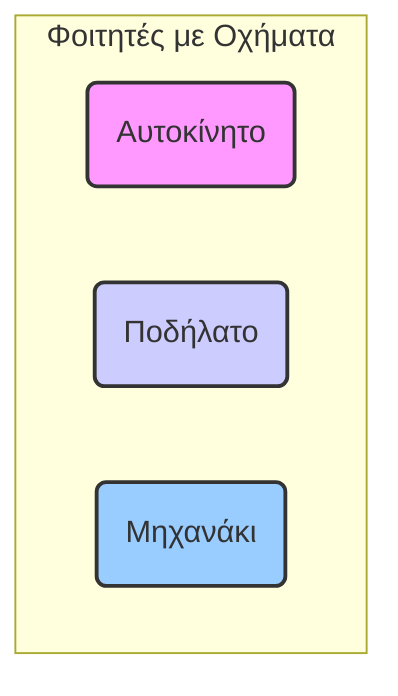
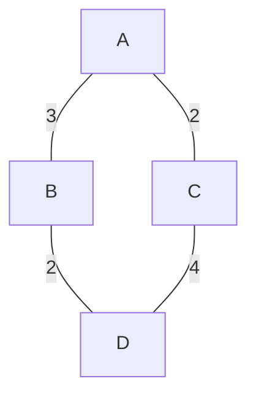
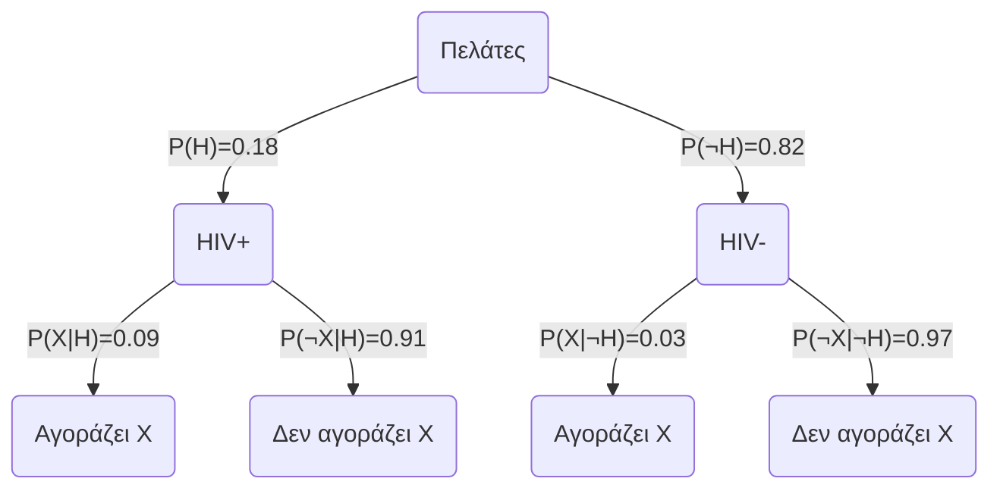

---

# ΔΙΑΚΡΙΤΑ ΜΑΘΗΜΑΤΙΚΑ: Θεωρία και Λύσεις Ασκήσεων

## Εισαγωγή

Αυτό το έγγραφο παρέχει το θεωρητικό υπόβαθρο και τις μεθοδολογίες που απαιτούνται για την επίλυση των ασκήσεων από το σετ που δόθηκε. Κάθε ενότητα ξεκινά με μια επισκόπηση της σχετικής θεωρίας και ακολουθεί η εφαρμογή της στις συγκεκριμένες ασκήσεις.

---

## 1. Μαθηματική Λογική (Mathematical Logic)

Η Μαθηματική Λογική είναι η μελέτη της τυπικής λογικής και της συλλογιστικής. Χρησιμοποιεί σύμβολα για να αναπαραστήσει προτάσεις και λογικούς συνδέσμους για να δημιουργήσει σύνθετες εκφράσεις.

### Θεωρητικό Υπόβαθρο

**Προτάσεις (Propositions):**
Μια πρόταση είναι μια δηλωτική πρόταση που είναι είτε αληθής (True, T, 1) είτε ψευδής (False, F, 0). Παραδείγματα: `p`, `q`, `r`.

**Λογικοί Σύνδεσμοι (Logical Connectives):**
*   **Άρνηση (Negation):** `¬p` (όχι p). Είναι αληθής όταν το `p` είναι ψευδές.
*   **Σύζευξη (Conjunction):** `p ∧ q` (p και q). Είναι αληθής μόνο όταν και τα δύο `p` και `q` είναι αληθή.
*   **Διάζευξη (Disjunction):** `p ∨ q` (p ή q). Είναι αληθής όταν τουλάχιστον ένα από τα `p` ή `q` είναι αληθές.
*   **Συνεπαγωγή (Implication):** `p → q` (αν p τότε q). Είναι ψευδής μόνο όταν το `p` είναι αληθές και το `q` είναι ψευδές. Μπορεί να γραφτεί και ως `¬p ∨ q`.
*   **Ισοδυναμία (Equivalence):** `p ↔ q` (p αν και μόνο αν q). Είναι αληθής όταν τα `p` και `q` έχουν την ίδια τιμή αληθείας.

**Πίνακες Αληθείας (Truth Tables):**
Ένας πίνακας αληθείας δείχνει την τιμή αληθείας μιας σύνθετης πρότασης για όλους τους πιθανούς συνδυασμούς τιμών αληθείας των απλών προτάσεών της. Για `n` μεταβλητές, ο πίνακας έχει `2^n` γραμμές.

**Ταυτολογία και Αντίφαση (Tautology and Contradiction):**
*   Μια **ταυτολογία** είναι μια πρόταση που είναι πάντα αληθής, ανεξάρτητα από τις τιμές αληθείας των συνιστωσών της.
*   Μια **αντίφαση** είναι μια πρόταση που είναι πάντα ψευδής.

**Κανόνες της Προτασιακής Λογικής (Laws of Propositional Logic):**
Αυτοί είναι κανόνες που επιτρέπουν την αλγεβρική απλοποίηση και απόδειξη ισοδυναμιών. Οι βασικότεροι είναι:
*   **Νόμοι De Morgan:** `¬(p ∧ q) ≡ ¬p ∨ ¬q` και `¬(p ∨ q) ≡ ¬p ∧ ¬q`
*   **Επιμεριστικοί Νόμοι (Distributive):** `p ∧ (q ∨ r) ≡ (p ∧ q) ∨ (p ∧ r)` και `p ∨ (q ∧ r) ≡ (p ∨ q) ∧ (p ∨ r)`
*   **Προσεταιριστικοί Νόμοι (Associative):** `(p ∧ q) ∧ r ≡ p ∧ (q ∧ r)` και `(p ∨ q) ∨ r ≡ p ∨ (q ∨ r)`
*   **Αντιμεταθετικοί Νόμοι (Commutative):** `p ∧ q ≡ q ∧ p` και `p ∨ q ≡ q ∨ p`
*   **Ορισμός Συνεπαγωγής:** `p → q ≡ ¬p ∨ q`

### Επίλυση Ασκήσεων

#### **Άσκηση 1.1**

**Πρόβλημα:** Κατασκευάστε τον πίνακα αληθείας για τον τύπο `(p → q) → ((p ∨ r) → (q ∨ r))` και αναφέρετε αν είναι ταυτολογία ή αντίφαση.

**Μέθοδος:** Θα κατασκευάσουμε έναν πίνακα με `2^3 = 8` γραμμές για τις μεταβλητές `p, q, r`.

| p | q | r | `p → q` | `p ∨ r` | `q ∨ r` | `(p ∨ r) → (q ∨ r)` | **(p → q) → ((p ∨ r) → (q ∨ r))** |
|:---:|:---:|:---:|:---:|:---:|:---:|:---:|:---:|
| T | T | T | T | T | T | T | **T** |
| T | T | F | T | T | T | T | **T** |
| T | F | T | F | T | T | T | **T** |
| T | F | F | F | T | F | F | **T** |
| F | T | T | T | T | T | T | **T** |
| F | T | F | T | F | T | T | **T** |
| F | F | T | T | T | T | T | **T** |
| F | F | F | T | F | F | T | **T** |

**Συμπέρασμα:** Η τελική στήλη του πίνακα αληθείας περιέχει μόνο την τιμή "Αληθής" (T). Επομένως, ο προτασιακός τύπος είναι **ταυτολογία**.

---

#### **Άσκηση 1.2**

**Πρόβλημα:** Δείξτε την ταυτολογική ισοδυναμία `¬(p ∧ q) ∧ (p ∨ ¬q) ≡ p → ¬q`.

**Σημείωση:** Υπάρχει ένα πιθανό τυπογραφικό λάθος στην άσκηση όπως δίνεται στο έγγραφο. Η ισοδυναμία που ζητείται να αποδειχθεί δεν ισχύει πάντα. Μια πιο κοινή και έγκυρη ταυτολογική ισοδυναμία με παρόμοια μορφή είναι `¬p ∨ (p ∧ ¬q) ≡ p → ¬q`. Θα αποδείξουμε αυτήν την ισοδυναμία.

**Μέθοδος:** Θα ξεκινήσουμε από το αριστερό μέλος (LHS) και θα το μετασχηματίσουμε στο δεξί μέλος (RHS) χρησιμοποιώντας τους κανόνες της λογικής.

Θέλουμε να αποδείξουμε: `¬p ∨ (p ∧ ¬q) ≡ p → ¬q`

1.  **Αριστερό Μέλος (LHS):** `¬p ∨ (p ∧ ¬q)`
2.  Εφαρμόζουμε τον **Επιμεριστικό Νόμο**: `(¬p ∨ p) ∧ (¬p ∨ ¬q)`
3.  Η έκφραση `¬p ∨ p` είναι πάντα αληθής (Νόμος του Αποκλειομένου Μέσου), δηλαδή `T`.
    Άρα έχουμε: `T ∧ (¬p ∨ ¬q)`
4.  Οτιδήποτε σε σύζευξη με το `T` παραμένει το ίδιο (Ουδέτερο στοιχείο).
    Άρα: `¬p ∨ ¬q`
5.  **Δεξί Μέλος (RHS):** `p → ¬q`
6.  Χρησιμοποιώντας τον **Ορισμό της Συνεπαγωγής** (`A → B ≡ ¬A ∨ B`), έχουμε:
    `p → ¬q ≡ ¬p ∨ ¬q`

Αφού το LHS απλοποιείται σε `¬p ∨ ¬q` και το RHS είναι ισοδύναμο με `¬p ∨ ¬q`, αποδείξαμε ότι **LHS ≡ RHS**.

---

## 2. Θεωρία Συνόλων (Set Theory)

Η θεωρία συνόλων είναι ο κλάδος των μαθηματικών που μελετά τα σύνολα, δηλαδή τις συλλογές αντικειμένων.

### Θεωρητικό Υπόβαθρο

**Βασικές Πράξεις Συνόλων:**
*   **Ένωση (Union):** `A ∪ B`. Το σύνολο των στοιχείων που ανήκουν στο `A`, ή στο `B`, ή και στα δύο.
*   **Τομή (Intersection):** `A ∩ B`. Το σύνολο των στοιχείων που ανήκουν και στο `A` και στο `B`.
*   **Διαφορά (Difference):** `A \ B`. Το σύνολο των στοιχείων που ανήκουν στο `A` αλλά όχι στο `B`.
*   **Συμπλήρωμα (Complement):** `A'`. Το σύνολο των στοιχείων που δεν ανήκουν στο `A` (σε σχέση με ένα καθολικό σύνολο `U`).
*   **Πληθάριθμος (Cardinality):** `|A|`. Ο αριθμός των στοιχείων σε ένα σύνολο `A`.

**Ιδιότητες Πράξεων Συνόλων:**
*   **Νόμοι De Morgan:** `(A ∪ B)' = A' ∩ B'` και `(A ∩ B)' = A' ∪ B'`
*   **Επιμεριστικοί Νόμοι:** `A ∩ (B ∪ C) = (A ∩ B) ∪ (A ∩ C)`
*   **Ορισμός Διαφοράς:** `A \ B = A ∩ B'`

**Αρχή Εγκλεισμού-Αποκλεισμού (Principle of Inclusion-Exclusion):**
Για τρία σύνολα, ο πληθάριθμος της ένωσής τους είναι:
$$|A ∪ B ∪ C| = |A| + |B| + |C| - |A ∩ B| - |A ∩ C| - |B ∩ C| + |A ∩ B ∩ C|$$

### Επίλυση Ασκήσεων

#### **Άσκηση 2.1**

**Πρόβλημα:** Δείξτε την ταυτότητα: `(A \ B) ∩ (A \ C) = A \ (B ∪ C)`

**Μέθοδος:** Θα χρησιμοποιήσουμε τις ιδιότητες των συνόλων για να μετασχηματίσουμε το αριστερό μέλος.

1.  **Αριστερό Μέλος (LHS):** `(A \ B) ∩ (A \ C)`
2.  Χρησιμοποιούμε τον ορισμό της διαφοράς (`X \ Y = X ∩ Y'`):
    `= (A ∩ B') ∩ (A ∩ C')`
3.  Εφαρμόζουμε τον Αντιμεταθετικό και Προσεταιριστικό νόμο για την τομή:
    `= (A ∩ A) ∩ (B' ∩ C')`
4.  `A ∩ A = A` (Ταυτοδυναμία):
    `= A ∩ (B' ∩ C')`
5.  Εφαρμόζουμε το Νόμο του De Morgan (`B' ∩ C' = (B ∪ C)'`):
    `= A ∩ (B ∪ C)'`
6.  Χρησιμοποιούμε ξανά τον ορισμό της διαφοράς, αυτή τη φορά αντίστροφα (`X ∩ Y' = X \ Y`):
    `= A \ (B ∪ C)`
7.  Αυτό είναι το **Δεξί Μέλος (RHS)**. Η ταυτότητα αποδείχθηκε.

---

#### **Άσκηση 2.2**

**Πρόβλημα:** Σε 150 φοιτητές, 83 έχουν αυτοκίνητο (Α), 97 ποδήλατο (Π), 28 μηχανάκι (Μ). 53 έχουν Α και Π, 14 έχουν Α και Μ, 7 έχουν Π και Μ, και 2 έχουν και τα τρία. Πόσοι δεν έχουν τίποτα;

**Μέθοδος:** Θα χρησιμοποιήσουμε την Αρχή Εγκλεισμού-Αποκλεισμού για να βρούμε πόσοι φοιτητές έχουν τουλάχιστον ένα όχημα.

**Δεδομένα:**
*   Καθολικό σύνολο `|U| = 150`
*   `|A| = 83`
*   `|Π| = 97`
*   `|M| = 28`
*   `|A ∩ Π| = 53`
*   `|A ∩ M| = 14`
*   `|Π ∩ M| = 7`
*   `|A ∩ Π ∩ M| = 2`

**Οπτικοποίηση με Διάγραμμα Venn:**

**Υπολογισμός:**
1.  Βρίσκουμε τον αριθμό των φοιτητών που έχουν τουλάχιστον ένα όχημα, `|A ∪ Π ∪ M|`:
    $$|A ∪ Π ∪ M| = |A| + |Π| + |M| - |A ∩ Π| - |A ∩ M| - |Π ∩ M| + |A ∩ Π ∩ M|$$
    $$|A ∪ Π ∪ M| = 83 + 97 + 28 - 53 - 14 - 7 + 2$$
    $$|A ∪ Π ∪ M| = 208 - 74 + 2$$
    $$|A ∪ Π ∪ M| = 136$$
    Άρα, 136 φοιτητές έχουν τουλάχιστον ένα από τα τρία οχήματα.

2.  Για να βρούμε πόσοι δεν έχουν κανένα, αφαιρούμε αυτόν τον αριθμό από το σύνολο των φοιτητών:
    Αριθμός φοιτητών χωρίς όχημα = `|U| - |A ∪ Π ∪ M|`
    `= 150 - 136`
    `= 14`

**Απάντηση:** **14** φοιτητές δεν έχουν τίποτα από τα τρία.

---

## 3. Συνδυαστική (Combinatorics)

Η Συνδυαστική ασχολείται με τη μελέτη των μεθόδων απαρίθμησης, συνδυασμού και διάταξης αντικειμένων.

### Θεωρητικό Υπόβαθρο

*   **Πολλαπλασιαστική Αρχή (Product Rule):** Αν μια διαδικασία αποτελείται από `k` βήματα, και το 1ο βήμα μπορεί να γίνει με `n₁` τρόπους, το 2ο με `n₂` τρόπους, ..., το k-οστό με `nₖ` τρόπους, τότε η συνολική διαδικασία μπορεί να γίνει με `n₁ × n₂ × ... × nₖ` τρόπους.

*   **Διατάξεις (Permutations):** Απαρίθμηση των τρόπων διάταξης `k` αντικειμένων από ένα σύνολο `n` διακεκριμένων αντικειμένων, όπου η σειρά έχει σημασία.
    *   **Χωρίς επανάληψη:** `P(n, k) = n! / (n-k)!`
    *   **Με επανάληψη:** `n^k`

*   **Συνδυασμοί (Combinations):** Απαρίθμηση των τρόπων επιλογής `k` αντικειμένων από ένα σύνολο `n` αντικειμένων, όπου η σειρά ΔΕΝ έχει σημασία.
    *   **Χωρίς επανάληψη:** `C(n, k) = n! / (k! * (n-k)!)`
    *   **Με επανάληψη (Stars and Bars):** Επιλογή `k` αντικειμένων από `n` τύπους, όπου η επανάληψη επιτρέπεται. `C(n + k - 1, k)`.

*   **Μεταθέσεις με Επανάληψη (Permutations with Repetition):** Διάταξη `n` αντικειμένων όπου υπάρχουν `n₁` όμοια αντικείμενα του 1ου τύπου, `n₂` του 2ου, κ.λπ.
    $$ \frac{n!}{n_1! n_2! \dots n_k!} $$

### Επίλυση Ασκήσεων

#### **Άσκηση 3.1**

**Πρόβλημα:** Απαρίθμηση μονοπατιών από τον κόμβο Α στον D σε ένα δίκτυο, όπου κάθε κόμβος επισκέπτεται το πολύ μία φορά.

**Δεδομένα Δικτύου:**
*   A-C: 2 σύνδεσμοι
*   B-D: 2 σύνδεσμοι
*   A-B: 3 σύνδεσμοι
*   C-D: 4 σύνδεσμοι
*   A-D: 0 σύνδεσμοι
*   B-C: 0 σύνδεσμοι

**Οπτικοποίηση Δικτύου:**

**Μέθοδος:** Ένα μονοπάτι από το Α στο D χωρίς επανάληψη κόμβων μπορεί να είναι είτε `A → B → D` είτε `A → C → D`.

1.  **Μονοπάτι A → B → D:**
    *   Για να πάμε από το Α στο Β, έχουμε 3 επιλογές (συνδέσμους).
    *   Για να πάμε από το Β στο D, έχουμε 2 επιλογές.
    *   Σύμφωνα με την Πολλαπλασιαστική Αρχή, ο συνολικός αριθμός μονοπατιών μέσω του Β είναι: `3 × 2 = 6`.

2.  **Μονοπάτι A → C → D:**
    *   Για να πάμε από το Α στο C, έχουμε 2 επιλογές.
    *   Για να πάμε από το C στο D, έχουμε 4 επιλογές.
    *   Σύμφωνα με την Πολλαπλασιαστική Αρχή, ο συνολικός αριθμός μονοπατιών μέσω του C είναι: `2 × 4 = 8`.

**Συνολικά Μονοπάτια:**
Ο συνολικός αριθμός μονοπατιών είναι το άθροισμα των μονοπατιών από τις δύο παραπάνω διαδρομές (Αθροιστική Αρχή):
`6 (μέσω Β) + 8 (μέσω C) = 14`.

**Απάντηση:** Υπάρχουν **14** δυνατά μονοπάτια.

---

#### **Άσκηση 3.2**

**Πρόβλημα:** Ονομασίες μετοχών μήκους 3 από το λατινικό αλφάβητο (26 γράμματα).

**α'. Επιτρέπεται επανάληψη συμβόλων:**
*   Για τη 1η θέση, έχουμε 26 επιλογές.
*   Για τη 2η θέση, έχουμε 26 επιλογές.
*   Για την 3η θέση, έχουμε 26 επιλογές.
Σύνολο: `26 × 26 × 26 = 26^3 = 17,576` ονομασίες.

**β'. Δεν επιτρέπεται επανάληψη (κάθε σύμβολο το πολύ μία φορά):**
*   Για τη 1η θέση, έχουμε 26 επιλογές.
*   Για τη 2η θέση, απομένουν 25 επιλογές.
*   Για την 3η θέση, απομένουν 24 επιλογές.
Σύνολο: `26 × 25 × 24 = P(26, 3) = 15,600` ονομασίες.

---

#### **Άσκηση 3.3**

**Πρόβλημα:** Επιλογή 5 παικτών (μια 5-άδα) από ένα ρόστερ 15 παικτών.

**Μέθοδος:** Η σειρά επιλογής των παικτών δεν έχει σημασία, άρα πρόκειται για **συνδυασμούς**.

*   `n = 15` (σύνολο παικτών)
*   `k = 5` (παίκτες προς επιλογή)

Χρησιμοποιούμε τον τύπο των συνδυασμών `C(n, k)`:
$$ C(15, 5) = \frac{15!}{5!(15-5)!} = \frac{15!}{5!10!} = \frac{15 \times 14 \times 13 \times 12 \times 11}{5 \times 4 \times 3 \times 2 \times 1} $$
$$ C(15, 5) = 3 \times 7 \times 13 \times 1 \times 11 = 3003 $$

**Απάντηση:** Υπάρχουν **3,003** δυνατές 5-άδες.

---

#### **Άσκηση 3.4**

**Πρόβλημα:** Διαφορετικές διατάξεις βιβλίων σε ένα ράφι: 5 όμοια του 1ου, 4 του 2ου, 3 του 3ου.

**Μέθοδος:** Έχουμε συνολικά `n = 5 + 4 + 3 = 12` θέσεις. Ωστόσο, τα βιβλία κάθε είδους είναι όμοια, άρα χρησιμοποιούμε μεταθέσεις με επανάληψη.

*   `n = 12` (συνολικά βιβλία)
*   `n₁ = 5` (όμοια τύπου 1)
*   `n₂ = 4` (όμοια τύπου 2)
*   `n₃ = 3` (όμοια τύπου 3)

$$ \frac{12!}{5!4!3!} = \frac{479,001,600}{(120)(24)(6)} = \frac{479,001,600}{17,280} = 27,720 $$

**Απάντηση:** Υπάρχουν **27,720** διαφορετικές διατάξεις.

---

#### **Άσκηση 3.5**

**Πρόβλημα:** Δημιουργία ανθοδέσμης 12 λουλουδιών από 4 διαθέσιμα είδη (τριαντάφυλλα, γαρύφαλα, κρίνα, σκυλάκια).

**Μέθοδος:** Η σειρά δεν έχει σημασία και μπορούμε να επιλέξουμε το ίδιο είδος λουλουδιού πολλές φορές. Πρόκειται για **συνδυασμούς με επανάληψη** (Stars and Bars).

*   `n = 4` (τύποι λουλουδιών / κατηγορίες)
*   `k = 12` (λουλούδια προς επιλογή)

Χρησιμοποιούμε τον τύπο `C(n + k - 1, k)`:
$$ C(4 + 12 - 1, 12) = C(15, 12) $$
Αυτό είναι ισοδύναμο με `C(15, 15 - 12) = C(15, 3)`:
$$ C(15, 3) = \frac{15!}{3!(15-3)!} = \frac{15 \times 14 \times 13}{3 \times 2 \times 1} = 5 \times 7 \times 13 = 455 $$

**Απάντηση:** Μπορούν να σχηματιστούν **455** διαφορετικές ανθοδέσμες.

---

## 4. Θεωρία Πιθανοτήτων (Probability Theory)

Η Θεωρία Πιθανοτήτων μελετά τη μαθηματική τυποποίηση της αβεβαιότητας.

### Θεωρητικό Υπόβαθρο

*   **Πιθανότητα (Probability):** Για ένα γεγονός `E`, η πιθανότητα `P(E)` είναι ο λόγος των ευνοϊκών εκβάσεων προς το σύνολο των δυνατών εκβάσεων (σε έναν δειγματικό χώρο με ισοπίθανα ενδεχόμενα).
    `P(E) = (Αριθμός Ευνοϊκών Εκβάσεων) / (Συνολικός Αριθμός Δυνατών Εκβάσεων)`

*   **Δεσμευμένη Πιθανότητα (Conditional Probability):** Η πιθανότητα να συμβεί το γεγονός `A`, δεδομένου ότι το `B` έχει ήδη συμβεί.
    $$ P(A|B) = \frac{P(A \cap B)}{P(B)} $$

*   **Νόμος Ολικής Πιθανότητας (Law of Total Probability):** Αν `B₁, B₂, ..., Bₙ` είναι μια διαμέριση του δειγματικού χώρου, τότε για οποιοδήποτε γεγονός `A`:
    $$ P(A) = \sum_{i=1}^{n} P(A|B_i)P(B_i) $$

*   **Θεώρημα του Bayes (Bayes' Theorem):**
    $$ P(B_i|A) = \frac{P(A|B_i)P(B_i)}{P(A)} = \frac{P(A|B_i)P(B_i)}{\sum_{j=1}^{n} P(A|B_j)P(B_j)} $$

### Επίλυση Ασκήσεων

#### **Άσκηση 4.1**

**Πρόβλημα:** Τρεις άνθρωποι σε μαραθώνιο, με ίδια πιθανότητα (0.5) να τερματίσουν (Τ) ή να εγκαταλείψουν (Ε).

**Δειγματικός Χώρος:** Κάθε άτομο έχει 2 εκβάσεις. 3 άτομα → `2^3 = 8` συνολικές δυνατές εκβάσεις.
{TTT, TTΕ, TΕT, ΕTT, TΕΕ, ΕTΕ, ΕΕT, ΕΕΕ}
Κάθε έκβαση έχει πιθανότητα `(0.5)^3 = 1/8`.

**α'. Κανένας να μην τερματίσει:**
*   Ευνοϊκή έκβαση: {ΕΕΕ}.
*   Υπάρχει 1 τέτοια έκβαση.
*   `P(Κανένας) = 1/8`.

**β'. Ακριβώς ένας να τερματίσει:**
*   Ευνοϊκές εκβάσεις: {TΕΕ, ΕTΕ, ΕΕT}.
*   Υπάρχουν 3 τέτοιες εκβάσεις.
*   `P(Ακριβώς ένας) = 3/8`.

**γ'. Τουλάχιστον δύο να τερματίσουν:**
*   Ευνοϊκές εκβάσεις: {TTΕ, TΕT, ΕTT, TTT}.
*   Υπάρχουν 4 τέτοιες εκβάσεις.
*   `P(Τουλάχιστον δύο) = 4/8 = 1/2`.

---

#### **Άσκηση 4.2**

**Πρόβλημα:** Προτιμήσεις σε ασιατικό φαγητό.
*   `P(T) = 0.47`, `P(I) = 0.39`, `P(K) = 0.78`
*   `P(T ∩ I) = 0.23`, `P(I ∩ K) = 0.31`, `P(T ∩ K) = 0.29`
*   Η έρευνα αφορά αναγνώστες στους οποίους αρέσει το ασιατικό φαγητό, άρα μπορούμε να υποθέσουμε `P(T ∪ I ∪ K) = 1`.

**α'. Υπολογίστε την πιθανότητα να αρέσουν και οι τρεις τύποι φαγητού `P(T ∩ I ∩ K)`.**
Χρησιμοποιούμε τον τύπο εγκλεισμού-αποκλεισμού για πιθανότητες:
`P(T ∪ I ∪ K) = P(T) + P(I) + P(K) - P(T ∩ I) - P(T ∩ K) - P(I ∩ K) + P(T ∩ I ∩ K)`
`1 = 0.47 + 0.39 + 0.78 - 0.23 - 0.29 - 0.31 + P(T ∩ I ∩ K)`
`1 = 1.64 - 0.83 + P(T ∩ I ∩ K)`
`1 = 0.81 + P(T ∩ I ∩ K)`
`P(T ∩ I ∩ K) = 1 - 0.81 = 0.19`
**Απάντηση:** Η πιθανότητα είναι **19%**.

**β'. Υπολογίστε την πιθανότητα να αρέσει το κινέζικο, δεδομένου ότι αρέσει το ινδικό `P(K|I)`.**
Χρησιμοποιούμε τον τύπο της δεσμευμένης πιθανότητας:
$$ P(K|I) = \frac{P(K \cap I)}{P(I)} $$
$$ P(K|I) = \frac{0.31}{0.39} \approx 0.7949 $$
**Απάντηση:** Η πιθανότητα είναι περίπου **79.5%**.

---

#### **Άσκηση 4.3**

**Πρόβλημα:** Φάρμακο Χ και HIV. Να βρεθεί η πιθανότητα ένας πελάτης που αγοράζει το Χ να είναι θετικός στον HIV.

**Μέθοδος:** Αυτό είναι ένα κλασικό πρόβλημα για το **Θεώρημα του Bayes**.

**Ορισμός Γεγονότων:**
*   `H`: Ο πελάτης είναι θετικός στον HIV.
*   `¬H`: Ο πελάτης δεν είναι θετικός στον HIV.
*   `X`: Ο πελάτης αγοράζει τη θεραπεία Χ.

**Δεδομένες Πιθανότητες:**
*   `P(H) = 0.18` (18% των πελατών είναι θετικοί)
*   `P(¬H) = 1 - 0.18 = 0.82`
*   `P(X|H) = 0.09` (Η πιθανότητα να αγοράσει το Χ, δεδομένου ότι είναι θετικός)
*   `P(X|¬H) = 0.03` (Η πιθανότητα να αγοράσει το Χ, δεδομένου ότι δεν είναι θετικός)

**Ζητούμενο:** `P(H|X)` (Η πιθανότητα να είναι θετικός, δεδομένου ότι αγόρασε το Χ).

**Οπτικοποίηση με Διάγραμμα Δέντρου (Διορθωμένο):**

**Επίλυση:**
1.  **Βήμα 1: Υπολογισμός της συνολικής πιθανότητας αγοράς του Χ, `P(X)`.**
    Χρησιμοποιούμε τον Νόμο Ολικής Πιθανότητας:
    `P(X) = P(X|H)P(H) + P(X|¬H)P(¬H)`
    `P(X) = (0.09)(0.18) + (0.03)(0.82)`
    `P(X) = 0.0162 + 0.0246`
    `P(X) = 0.0408`
    Άρα, 4.08% του συνόλου των πελατών αγοράζουν τη θεραπεία Χ.

2.  **Βήμα 2: Εφαρμογή του Θεωρήματος του Bayes.**
    $$ P(H|X) = \frac{P(X|H)P(H)}{P(X)} $$
    $$ P(H|X) = \frac{0.0162}{0.0408} \approx 0.39705 $$

**Απάντηση:** Η πιθανότητα ένας πελάτης που αγοράζει τη θεραπεία Χ να είναι θετικός στον HIV είναι περίπου **39.7%**.