 # Set Operations & Venn Diagrams

## Core Concepts

### 1. Universal Set (U)
-  **Definition**: Contains all possible elements for a given context
-  **Notation**: $U$ or Universe
-  **Example**: $U = \{1, 2, 3, 4, 5\}$ (positive integers ≤ 5)

### 2. Complement ($A^c$ or $\overline{A}$)
-  **Definition**: All elements in $U$ that are NOT in set $A$
-  **Formula**: $\overline{A} = \{x \in U : x \notin A\}$
-  **Example**: If $U = \{1, 2, 3, 4, 5\}$ and $A = \{1, 2\}$, then $\overline{A} = \{3, 4, 5\}$

### 1+2:

```mermaid
graph TD
    subgraph U ["🌍 Universe U = {1, 2, 3, 4, 5}"]
        subgraph A ["Set A = {1, 2}"]
            style A fill:#ffcccb,stroke:#ff6b6b,stroke-width:3px
            a1[1]
            a2[2]
        end
        
        c3[3]
        c4[4] 
        c5[5]
    end
    
    subgraph Legend [" "]
        L1["🔴 Set A"]
        L2["⚪ Complement A' = {3, 4, 5}"]
    end
    
    style U fill:#f0f8ff,stroke:#4682b4,stroke-width:2px
    style c3 fill:#f,stroke:#4caf50
    style c4 fill:#f,stroke:#4caf50  
    style c5 fill:#f,stroke:#4caf50
    style L1 fill:#f,stroke:#ff6b6b
    style L2 fill:#f,stroke:#4caf50

```

### 3. Intersection ($A \cap B$)
-  **Definition**: Elements common to both sets
-  **Formula**: $A \cap B = \{x : x \in A \text{ AND } x \in B\}$
-  **Example**: $\{1, 2, 3\} \cap \{3, 4, 5\} = \{3\}$

```mermaid
graph LR
    subgraph Venn ["Venn Diagram: A ∩ B"]
        subgraph SetA ["Set A = {1, 2, 3}"]
            a1[1]
            a2[2]
        end
        
        subgraph Overlap ["A ∩ B = {3}"]
            common[3]
        end
        
        subgraph SetB ["Set B = {3, 4, 5}"]
            b4[4]
            b5[5]
        end
    end
    
    style SetA fill:#ffebee,stroke:#e91e63,stroke-width:2px
    style SetB fill:#e3f2fd,stroke:#2196f3,stroke-width:2px
    style Overlap fill:#c8e6c9,stroke:#4caf50,stroke-width:3px
    style common fill:#81c784,stroke:#2e7d32,stroke-width:2px

```

### 4. Union ($A \cup B$)
-  **Definition**: All elements from either set (or both)
-  **Formula**: $A \cup B = \{x : x \in A \text{ OR } x \in B\}$
-  **Example**: $\{1, 2, 3\} \cup \{3, 4, 5\} = \{1, 2, 3, 4, 5\}$

```mermaid
graph TD
    subgraph Result ["🤝 Union: A ∪ B = {1, 2, 3, 4, 5}"]
        subgraph OnlyA ["Only in A"]
            style OnlyA fill:#ffebee,stroke:#e91e63
            ua1[1]
            ua2[2]
        end
        
        subgraph Both ["In Both A & B"]
            style Both fill:#fff3e0,stroke:#ff9800
            ub3[3]
        end
        
        subgraph OnlyB ["Only in B"]
            style OnlyB fill:#e3f2fd,stroke:#2196f3
            ub4[4]
            ub5[5]
        end
    end

```

### 5. Difference ($A - B$ or $A \setminus B$)
-  **Definition**: Elements in $A$ but not in $B$
-  **Formula**: $A - B = \{x : x \in A \text{ AND } x \notin B\}$
-  **Example**: $\{1, 2, 3\} - \{3, 4, 5\} = \{1, 2\}$

```mermaid
graph TD
    subgraph Operation ["A - B: Remove B elements from A"]
        subgraph Original ["Original Set A = {1, 2, 3}"]
            subgraph Keep ["✅ Keep (not in B)"]
                style Keep fill:#c8e6c9,stroke:#4caf50,stroke-width:2px
                k1[1]
                k2[2]
            end
            
            subgraph Remove ["❌ Remove (also in B)"]
                style Remove fill:#ffcdd2,stroke:#f44336,stroke-width:2px,stroke-dasharray: 5 5
                r3[3]
            end
        end
        
        subgraph Result ["📋 Result: A - B = {1, 2}"]
            style Result fill:#e8f5e8,stroke:#2e7d32,stroke-width:3px
            res1[1]
            res2[2]
        end
    end
    
    Keep --> Result
    style Operation fill:#f,stroke:#666

```

## Visual Representations

```mermaid
graph TD
    subgraph Summary ["🎯 Set Operations Visual Summary"]
        subgraph Row1 ["Basic Operations"]
            A1["🔴 Set A<br/>{1,2,3}"]
            B1["🔵 Set B<br/>{3,4,5}"]
        end
        
        subgraph Row2 ["Results"]
            Int["🟢 A ∩ B<br/>{3}"]
            Union["🟠 A ∪ B<br/>{1,2,3,4,5}"]
            Diff["🟡 A - B<br/>{1,2}"]
        end
    end
    
    A1 --> Int
    B1 --> Int
    A1 --> Union
    B1 --> Union
    A1 --> Diff
    
    style A1 fill:#ffebee,stroke:#e91e63
    style B1 fill:#e3f2fd,stroke:#2196f3
    style Int fill:#c8e6c9,stroke:#4caf50
    style Union fill:#fff3e0,stroke:#ff9800
    style Diff fill:#fff9c4,stroke:#f57f17

```

```mermaid
graph LR
    subgraph "Set Operations Examples"
        subgraph "A = {1, 2, 3}"
            A1[1] 
            A2[2]
            A3[3]
        end
        subgraph "B = {3, 4, 5}"
            B3[3]
            B4[4]
            B5[5]
        end
    end
    
    subgraph Results
        Int["A ∩ B = {3}"]
        Union["A ∪ B = {1, 2, 3, 4, 5}"]
        Diff["A - B = {1, 2}"]
    end
```

## Practice Exercises

**Given:**
-  $A = \{1, 3, 5, 7, 9\}$ (odd numbers < 10)
-  $B = \{4, 8, 12, 16\}$ (multiples of 4)
-  $C = \{1, 4, 9, 16\}$ (perfect squares)
-  $U = \{1, 2, 3, ..., 20\}$

**Calculate:**

1. $A \cup B$
2. $C \cap B$ 
3. $C - B$
4. $\emptyset \cap B$
5. $\overline{A}$ (complement of A)
6. $(A \cup C) \cap B$
7. $A - (B \cup C)$

**details**
1. **$A \cup B = \{1, 3, 4, 5, 7, 8, 9, 12, 16\}$**
   -  All unique elements from both sets

2. **$C \cap B = \{4, 16\}$**
   -  Common elements in both C and B

3. **$C - B = \{1, 9\}$**
   -  Elements in C but not in B

4. **$\emptyset \cap B = \emptyset$**
   -  Empty set intersected with any set = empty set

5. **$\overline{A} = \{2, 4, 6, 8, 10, 11, 12, 13, 14, 15, 16, 17, 18, 19, 20\}$**
   -  All elements in U not in A

6. **$(A \cup C) \cap B = \{4, 16\}$**
   -  First: $A \cup C = \{1, 3, 4, 5, 7, 9, 16\}$
   -  Then intersect with B

7. **$A - (B \cup C) = \{3, 5, 7\}$**
   -  First: $B \cup C = \{1, 4, 8, 9, 12, 16\}$
   -  Elements in A but not in $(B \cup C)$

## Key Properties

| Property     | Formula                                                | Description                                       |
| ------------ | ------------------------------------------------------ | ------------------------------------------------- |
| Commutative  | $A \cup B = B \cup A$                                  | Order doesn't matter                              |
| Associative  | $(A \cup B) \cup C = A \cup (B \cup C)$                | Grouping doesn't matter                           |
| Distributive | $A \cap (B \cup C) = (A \cap B) \cup (A \cap C)$       | Intersection distributes over union               |
| De Morgan's  | $\overline{A \cup B} = \overline{A} \cap \overline{B}$ | Complement of union = intersection of complements |