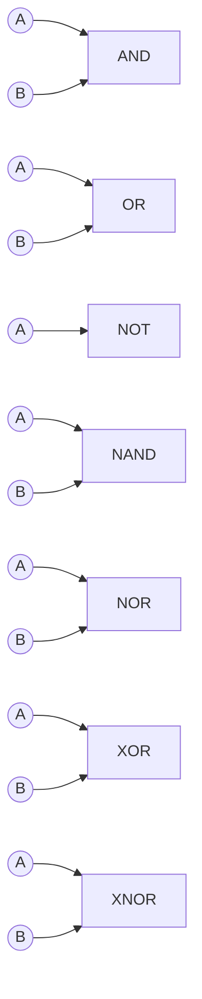
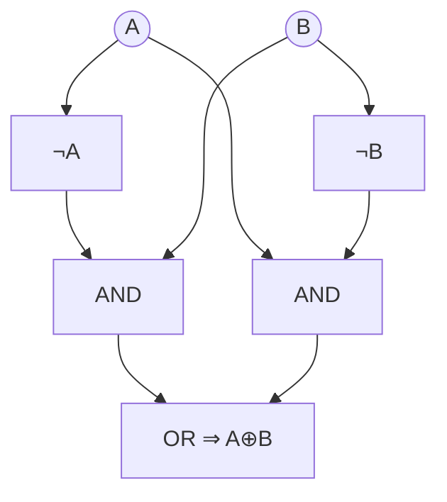
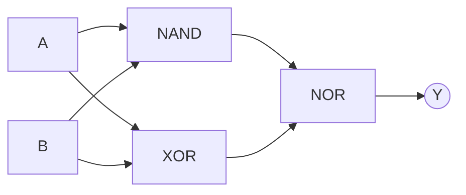
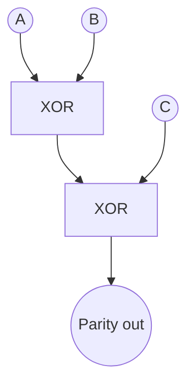

## Part 1 Theory of Logic Gates  

### **1. The seven basic gates**  
| Gate | Boolean symbol | Verbal rule (2-inputs) | Truth-table rule |  
|---|---|---|---|  
| AND | $$Y=A\cdot B$$ | “1 only if both inputs are 1” | 11 → 1, else 0 |  
| OR  | $$Y=A+B$$ | “1 if at least one input is 1” | 00 → 0, else 1 |  
| NOT | $$Y=\overline{A}$$ | “Inverts its single input” | 0 ↔ 1 |  
| NAND| $$Y=\overline{A\cdot B}$$ | “AND followed by NOT” | 11 → 0, else 1 |  
| NOR | $$Y=\overline{A+B}$$ | “OR followed by NOT” | 00 → 1, else 0 |  
| XOR | $$Y=A\oplus B$$ | “1 when inputs differ” | 00/11 → 0, 01/10 → 1 |  
| XNOR| $$Y=\overline{A\oplus B}$$ | “1 when inputs match” | 00/11 → 1, 01/10 → 0 |  

### **2. Visual cheat-sheet**

### **3. Spotlight on XOR**

* Boolean form (2-inputs): $$A\oplus B=\overline{A}B+A\overline{B}$$.  
* Parity view: for *n* inputs XOR outputs 1 iff the number of 1’s is odd.  
* Core properties  
  - Commutative $$A\oplus B=B\oplus A$$  
  - Associative $$(A\oplus B)\oplus C=A\oplus(B\oplus C)$$  
  - Identity $$A\oplus 0=A$$  
  - Self-inverse $$A\oplus A=0$$  
* Gate-level implementation (OR + AND + NOT):

* Applications: half-adders, parity checkers, cryptographic mixing.

---

## Part 2 Exercises taken from the video  

> *Try each task first, then click “Solution”.*

### **Exercise 1 – Complete the big truth table**

Fill the missing outputs for every gate when $$A=1,\;B=0$$.

| Gate | Expected output | Your answer |
|------|-----------------|-------------|
| AND  |                 |             |
| OR   |                 |             |
| NAND |                 |             |
| NOR  |                 |             |
| XOR  |                 |             |
| XNOR |                 |             |

Solution

| Gate | Output |
|------|--------|
| AND  | 0 |
| OR   | 1 |
| NAND | 1 |
| NOR  | 0 |
| XOR  | 1 |
| XNOR | 0 |
(Obtained directly from the rules in Part 1.)  

---

### **Exercise 2 – Circuit evaluation**

Evaluate $$Y=((A\;\text{NAND}\;B)\;\text{NOR}\;(A\oplus B))$$.

Given inputs $$A=1,\;B=1$$.

Solution

1. $$A\;\text{NAND}\;B = \overline{1\cdot1}=0$$.  
2. $$A\oplus B = 0$$.  
3. $$0\;\text{NOR}\;0=\overline{0+0}=1$$.  
So $$Y=1$$.

---

### **Exercise 3 – Show XOR associativity**

Prove $$(A\oplus B)\oplus C = A\oplus(B\oplus C)$$ with a truth table.

| A | B | C | $$A\oplus B$$ | LHS | $$B\oplus C$$ | RHS |
|---|---|---|--------------|-----|--------------|-----|
| 0 | 0 | 0 |              |     |              |     |
| 0 | 0 | 1 |              |     |              |     |
| 0 | 1 | 0 |              |     |              |     |
| 0 | 1 | 1 |              |     |              |     |
| 1 | 0 | 0 |              |     |              |     |
| 1 | 0 | 1 |              |     |              |     |
| 1 | 1 | 0 |              |     |              |     |
| 1 | 1 | 1 |              |     |              |     |

Solution

Filling the table with $$A\oplus B$$ etc. shows the LHS and RHS columns are identical for all 8 rows, confirming associativity (uses XOR rule in Section 3).

---

### **Exercise 4 – Build a 3-input parity checker**

Design a circuit that outputs 1 when an odd number of $$A,B,C$$ are 1.  
*(Hint : cascade two XOR gates.)*

**Solution diagram**

Because XOR is associative and signals “odd-ones-count”, $P=A\oplus B \oplus C$.  

---

### **Exercise 5 – Symmetric difference & XOR**

Let sets $A,B$. Show that the characteristic-bit of $A\triangle B$ equals $A\oplus B$.

**Solution**

For each universe element, its membership pair $$(a,b)$$ is mapped to  
$$A\triangle B =1$$ if the pair is (1,0) or (0,1); this is exactly the 2-input XOR truth table.

---

