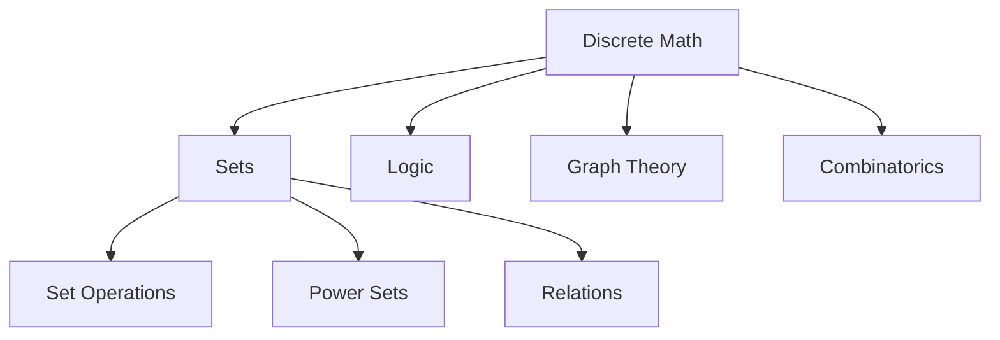

# Discrete Mathematics: Sets & Foundations

## Overview

**Discrete Mathematics** studies countable, distinct mathematical structures—the digital backbone of computer science.

---

## Core Concepts

### Sets Fundamentals

| Concept | Notation | Example |
|---------|----------|---------|
| **Roster Form** | `{a, b, c}` | $V = \{a, e, i, o, u\}$ |
| **Set-Builder** | `{x \| condition}` | $E = \{x \mid x \text{ even, } x > 0\}$ |
| **Cardinality** | `\|A\|` | $\|\{1,2,3\}\| = 3$ |
| **Empty Set** | `∅` | $\|\emptyset\| = 0$ |

### Set Relationships

$$A \subseteq B \iff \forall x(x \in A \rightarrow x \in B)$$

- **Subset**: $A \subseteq B$ (can be equal)
- **Proper Subset**: $A \subset B$ (strictly smaller)
- **Key Rule**: $\emptyset \subseteq$ every set

### Set Operations

| Operation | Symbol | Definition | Visual |
|-----------|--------|------------|--------|
| **Union** | $A \cup B$ | Elements in A or B | $\{1,2\} \cup \{2,3\} = \{1,2,3\}$ |
| **Intersection** | $A \cap B$ | Elements in both A and B | $\{1,2\} \cap \{2,3\} = \{2\}$ |
| **Difference** | $A - B$ | Elements in A but not B | $\{1,2\} - \{2,3\} = \{1\}$ |
| **Complement** | $A'$ | Elements not in A | If $U=\{1,2,3\}$, $A'=\{3\}$ |

---

## Power Sets

$$|P(A)| = 2^{|A|}$$

**Power Set**: Set of all subsets of A

### Quick Reference

| Set Size | Power Set Size | Example |
|----------|---------------|---------|
| 0 | 1 | $P(\emptyset) = \{\emptyset\}$ |
| 1 | 2 | $P(\{a\}) = \{\emptyset, \{a\}\}$ |
| 2 | 4 | $P(\{a,b\}) = \{\emptyset, \{a\}, \{b\}, \{a,b\}\}$ |
| n | $2^n$ | ... |

---

## Exercises & Solutions

### Exercise Set A: Basic Operations

**Q1:** Given $S = \{1, 2, 3\}$, classify each as subset/proper subset:
- $A = \{1, 3\}$
- $B = \{1, 2, 3\}$ 
- $C = \{1, 4\}$
- $D = \emptyset$

**Solutions:**
- $A \subset S$ ✓ (proper subset)
- $B \subseteq S$ ✓ (subset, not proper)
- $C \not\subseteq S$ ✗ (4 ∉ S)
- $D \subset S$ ✓ (proper subset)

### Exercise Set B: Power Sets

**Q2:** Find $P(\{a, b, c\})$

**Solution:** 
$$P(\{a,b,c\}) = \{\emptyset, \{a\}, \{b\}, \{c\}, \{a,b\}, \{a,c\}, \{b,c\}, \{a,b,c\}\}$$
Size: $2^3 = 8$ elements

**Q3:** Letters in "ALGEBRA" → $|P(M)|$?

**Solution:**
- Unique letters: $M = \{A, L, G, E, B, R\}$
- $|M| = 6$
- $|P(M)| = 2^6 = 64$

### Exercise Set C: Advanced Relationships

**Q4:** Given $A = \{s, t\}$, evaluate:
- $A \subseteq P(A)$?
- $A \in P(A)$?

**Analysis:**
$P(A) = \{\emptyset, \{s\}, \{t\}, \{s,t\}\}$

- $A \subseteq P(A)$: **False** (elements $s,t \notin P(A)$)
- $A \in P(A)$: **True** ($\{s,t\}$ is element of $P(A)$)

**Q5:** $C = \{0,1\}$, $D = \{x,y,z\}$ → $|P(C × D)|$?

**Solution:**
- $|C × D| = 2 × 3 = 6$
- $|P(C × D)| = 2^6 = 64$

---

## Key Takeaways

- **Element vs Subset**: $\in$ vs $\subseteq$
- **Power Set Growth**: Exponential ($2^n$)
- **Empty Set Rule**: $\emptyset$ is subset of everything
- **Cartesian Products**: $|A × B| = |A| × |B|$

