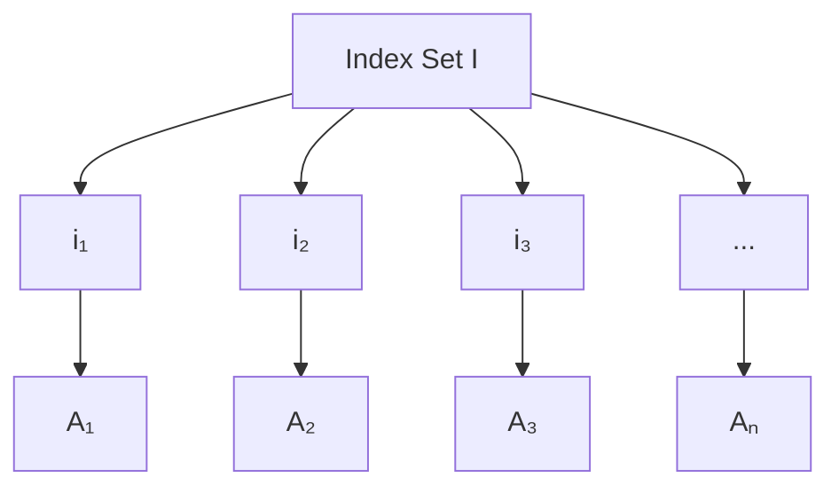
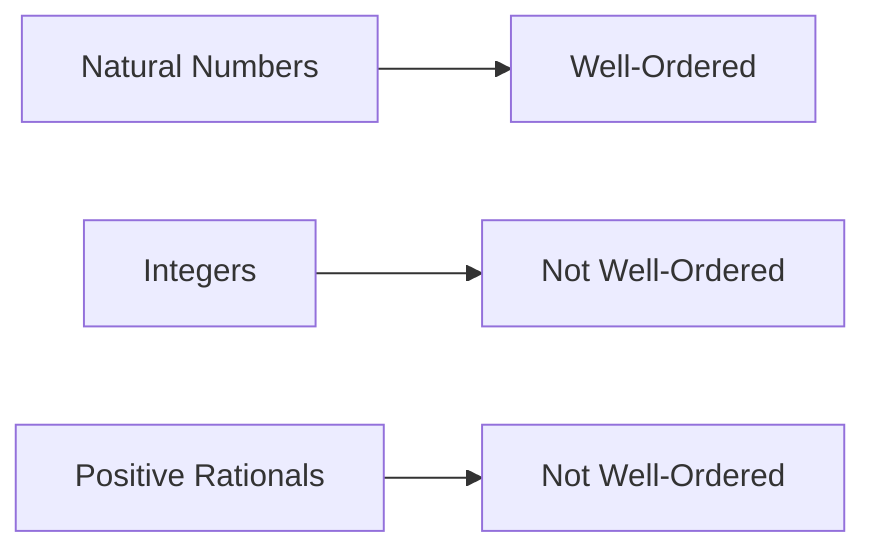

# 

## Part 1: Theory

### **Indexed Sets**

**Definition**: An indexed set is a collection of sets $\{A_i\}_{i \in I}$ where each set $A_i$ is associated with an index $i$ from an index set $I$.

**Notation**:
- Index set: $I = \{i_1, i_2, i_3, ...\}$
- Indexed family: $\{A_i : i \in I\}$ or $\{A_i\}_{i \in I}$

### **Operations on Indexed Sets**

**Union**: $$\bigcup_{i \in I} A_i = \{x : x \in A_i \text{ for some } i \in I\}$$

**Intersection**: $$\bigcap_{i \in I} A_i = \{x : x \in A_i \text{ for all } i \in I\}$$

### **Well Ordering Principle**

**Statement**: Every non-empty subset of positive integers has a least element.

**Formal Definition**: If $S \subseteq \mathbb{Z}^+$ and $S \neq \emptyset$, then: $$\exists m \in S$$ such that $m \leq s$ for all $s \in S$.

**Key Properties**:
- $\mathbb{N}$ is well-ordered
- $\mathbb{Z}$ is NOT well-ordered
- $\mathbb{Q}^+$ is NOT well-ordered

### **Applications & Equivalences**

The Well Ordering Principle is equivalent to:
- **Mathematical Induction**
- **Strong Induction** 
- **Axiom of Choice** (in certain contexts)

## Part 2: Exercises & Solutions

### **Exercise 1**: Indexed Set Operations

Given indexed sets $A_n = \{1, 2, ..., n\}$ for $n \in \mathbb{N}$, find:

**a)** $$\bigcup_{n=1}^{\infty} A_n$$
**b)** $$\bigcap_{n=1}^{\infty} A_n$$

**Solution**

**a)** $$\bigcup_{n=1}^{\infty} A_n = \mathbb{N}$$
- Every positive integer appears in some $A_n$

**b)** $$\bigcap_{n=1}^{\infty} A_n = \{1\}$$  
- Only 1 appears in all sets $A_n$

### **Exercise 2**: Well Ordering Application

Prove that every integer $n \geq 8$ can be written as $n = 3a + 5b$ where $a, b \in \mathbb{N} \cup \{0\}$.

**Solution**

**By Strong Induction**:
- **Base cases**: 
  - $n = 8 = 3(1) + 5(1)$ ✓
  - $n = 9 = 3(3) + 5(0)$ ✓  
  - $n = 10 = 3(0) + 5(2)$ ✓

- **Inductive step**: For $n \geq 11$, assume true for all $k < n$
  - Since $n-3 \geq 8$, by hypothesis: $n-3 = 3a + 5b$
  - Therefore: $n = 3(a+1) + 5b$ ✓

### **Exercise 3**: Counterexample Construction

Show that $\mathbb{Q}^+$ is not well-ordered by finding a subset with no minimum.

**Solution**

Consider $S = \{r \in \mathbb{Q}^+ : r > 1\}$

For any $r \in S$, we have $1 < \frac{r+1}{2} < r$, so $\frac{r+1}{2} \in S$ and $\frac{r+1}{2} < r$.

Therefore, $S$ has no minimum element, proving $\mathbb{Q}^+$ is not well-ordered.

### **Exercise 4**: Index Set Construction

Let $B_i = [i, i+1)$ for $i \in \mathbb{Z}$. Determine:

**a)** $$\bigcup_{i \in \mathbb{Z}} B_i$$
**b)** $$\bigcap_{i \in \mathbb{Z}} B_i$$

**Solution**

**a)** $$\bigcup_{i \in \mathbb{Z}} B_i = \mathbb{R}$$
- Every real number belongs to some interval $[i, i+1)$

**b)** $$\bigcap_{i \in \mathbb{Z}} B_i = \emptyset$$
- No real number belongs to all intervals simultaneously

### **Exercise 5**: Well Ordering Proof

Use WOP to prove: If $a, b \in \mathbb{Z}^+$ with $\gcd(a,b) = 1$, then $\gcd(a^n, b^n) = 1$ for all $n \in \mathbb{N}$.

**Solution**

**Proof by contradiction**:
Suppose $S = \{n \in \mathbb{N} : \gcd(a^n, b^n) > 1\} \neq \emptyset$

By WOP, $S$ has a minimum element $m$. Since $\gcd(a,b) = 1$, we have $m > 1$.

If prime $p | \gcd(a^m, b^m)$, then $p | a^m$ and $p | b^m$, so $p | a$ and $p | b$.

This contradicts $\gcd(a,b) = 1$, so $S = \emptyset$.

