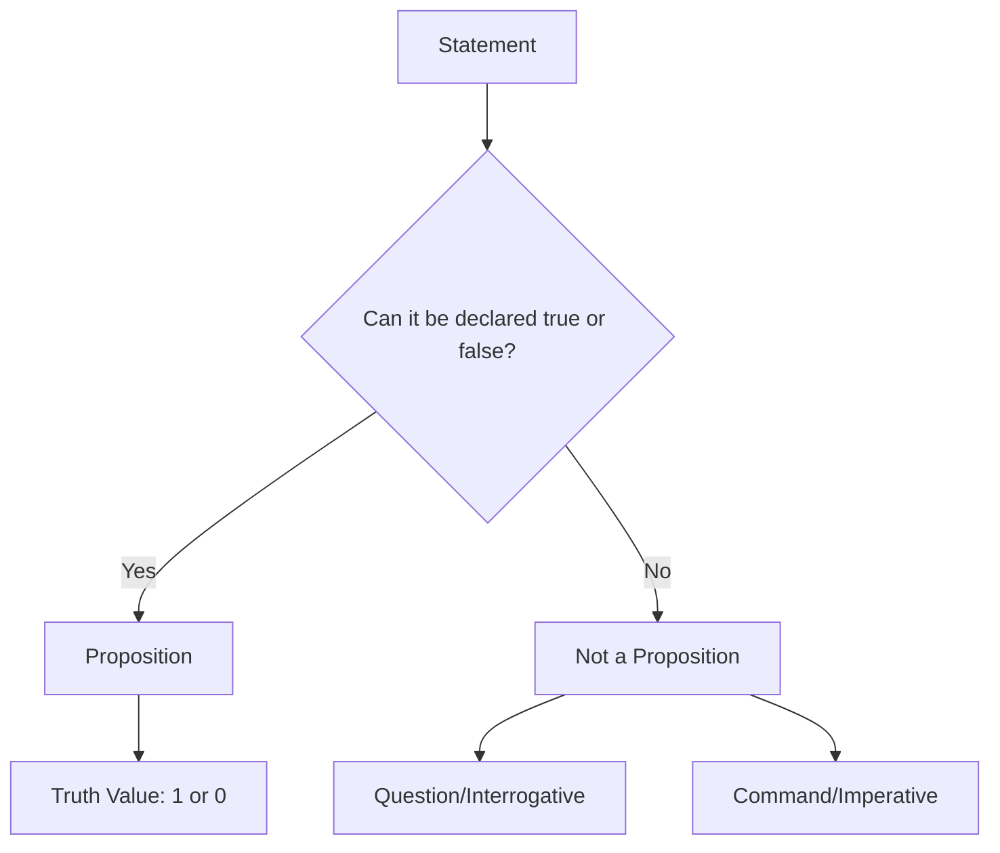
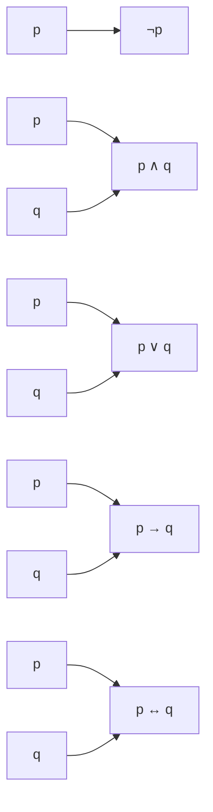
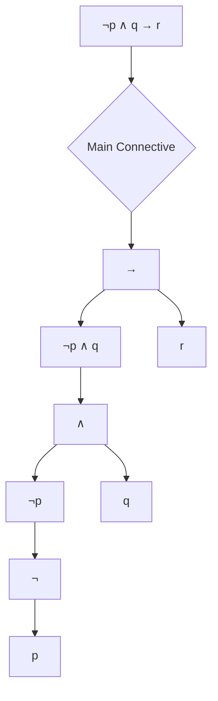
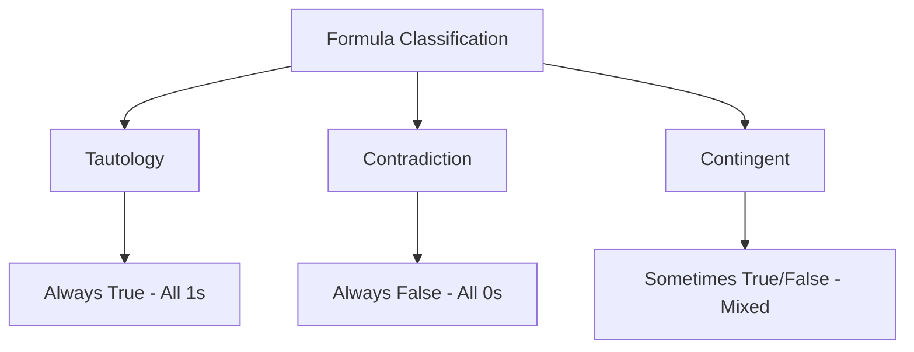
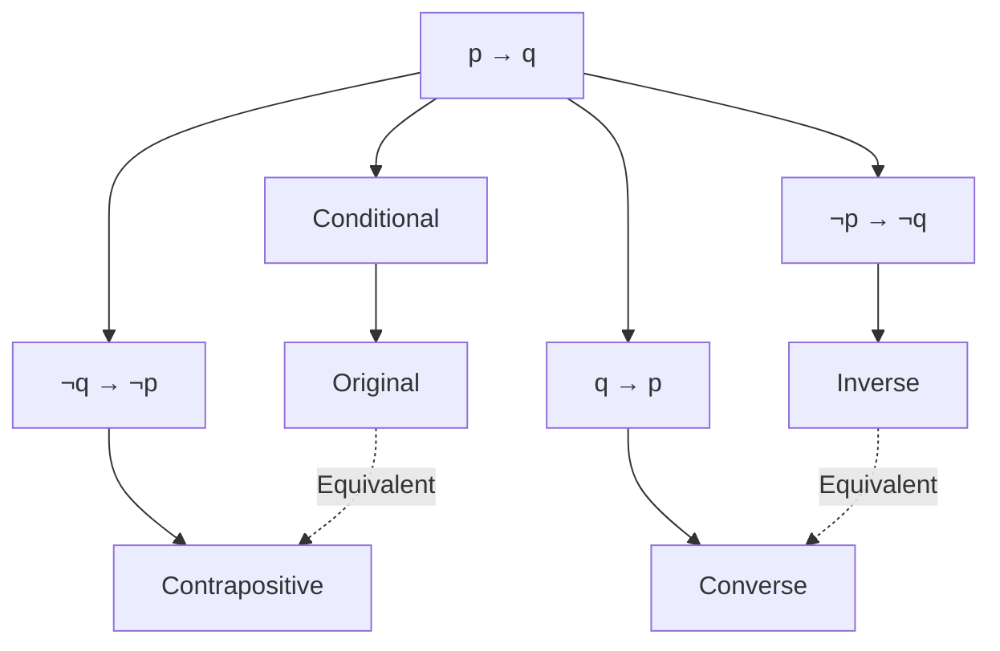
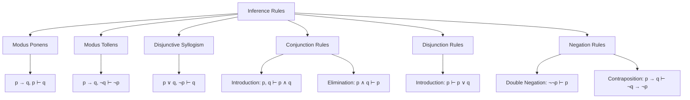

# Propositional Logic: Complete Study Notes


## 1. Propositions

### Definition and Characteristics
A **proposition** is any statement that can be declared as either true or false, but not both simultaneously. You don't need to know whether it's actually true or false - just that it can be one of those two values.

### Examples of Valid Propositions
- "The result of adding two rational numbers is rational" (true proposition)
- "Binary number 0 is used to represent false in logic" (true proposition)

### What Are NOT Propositions
- **Questions (Interrogatives)**: "Is this a proposition?" - cannot be true or false
- **Commands (Imperatives)**: "Take this from me and run" - cannot be true or false

### Truth Value Representation
In discrete mathematics, we use binary representation instead of T/F notation:
- **1** represents True
- **0** represents False



## 2. Logical Connectives

### Basic Connectives Overview
Logical connectives are operators that combine propositions to form compound statements. Here are the five fundamental connectives:
![[Pasted image 20250617223632.png]]

| Symbol | Alternative | Name | Description |
|--------|-------------|------|-------------|
| ¬ | ~, ! | Negation (NOT) | Flips truth value |
| ∧ | &, · | Conjunction (AND) | True only when both are true |
| ∨ | + | Disjunction (OR) | True when at least one is true |
| → | ⊃ | Conditional (IF-THEN) | False only when antecedent true, consequent false |
| ↔ | ≡ | Biconditional (IFF) | True when both have same truth value |

### Detailed Connective Explanations

#### Negation (¬)
- **Mathematical formula**: Value of ¬p = 1 - value of p
- **Example**: If "grass is green" is true, then "grass is not green" is false

#### Conjunction (∧)
- **Mathematical formula**: Value of p ∧ q = min(value of p, value of q)
- **English equivalents**: and, but, although, even though, however, in addition to
- **Truth condition**: True only when both propositions are true

#### Disjunction (∨)
- **Mathematical formula**: Value of p ∨ q = max(value of p, value of q)
- **English equivalents**: or, unless
- **Truth condition**: True when at least one proposition is true

#### Conditional (→)
- **Mathematical formula**: True if and only if value of p ≤ value of q
- **Structure**: If p (antecedent) then q (consequent)
- **Key insight**: False only when antecedent is true and consequent is false

#### Biconditional (↔)
- **Structure**: p if and only if q
- **Meaning**: Combines both directions (p → q and q → p)
- **Truth condition**: True when both propositions have the same truth value



## 3. Well-Formed Formulas (WFFs)

### Definition and Rules
A **well-formed formula** is a syntactically correct logical expression that follows specific construction rules.

### Valid Construction Rules
1. Any single proposition (p, q, r) is a WFF
2. If A is a WFF, then ¬A is a WFF
3. If A and B are WFFs, then (A ∧ B), (A ∨ B), (A → B), and (A ↔ B) are WFFs

### Invalid Constructions
- Two propositions without connectives: "p q" ❌
- Connectives without proper operands: "p ∧ ∨ q" ❌
- Hanging connectives: "p ∧" ❌

### Main Connective
The **main connective** is the operator that scopes over the entire formula. It's typically the last connective added when building the formula and can be identified by the outermost brackets.



## 4. Truth Tables

### Construction Method
Truth tables systematically list all possible truth value combinations for propositions.

#### Pattern for Multiple Variables
- **Rightmost column**: Alternate 1, 0, 1, 0...
- **Next column left**: Double up - 1, 1, 0, 0, 1, 1, 0, 0...
- **Continue pattern**: Keep doubling for each column moving left
- **Number of rows**: 2^n where n = number of variables

### Complete Truth Table for Basic Connectives

| p | q | ¬p | p ∧ q | p ∨ q | p → q | p ↔ q |
|---|---|----|----|----|----|----| 
| 1 | 1 | 0  | 1  | 1  | 1  | 1  |
| 1 | 0 | 0  | 0  | 1  | 0  | 0  |
| 0 | 1 | 1  | 0  | 1  | 1  | 0  |
| 0 | 0 | 1  | 0  | 0  | 1  | 1  |

### Complex Formula Evaluation
For complex formulas like (p ∧ q) ∨ (¬p ∧ ¬q), build columns step by step:
1. Basic propositions (p, q)
2. Negations (¬p, ¬q)
3. Simple conjunctions/disjunctions
4. Final compound expression

## 5. Classification of Formulas

### Tautologies
- **Definition**: Always true regardless of truth value assignments
- **Symbol**: ⊤ (top)
- **Examples**: p ∨ ¬p, ¬(p ∧ ¬p), p → p
- **Truth table result**: All 1s

### Contradictions
- **Definition**: Always false regardless of truth value assignments
- **Symbol**: ⊥ (falsum)
- **Examples**: p ∧ ¬p, ¬(p ∨ ¬p)
- **Truth table result**: All 0s

### Contingent Formulas
- **Definition**: Sometimes true, sometimes false
- **Examples**: p ∧ q, p → q, p ∨ q
- **Truth table result**: Mix of 1s and 0s



## 6. Logical Equivalence

### Definition
Two formulas are **logically equivalent** if they have identical truth values in all possible scenarios. This means they have the same truth table output.

### Examples of Equivalence
- p ↔ q ≡ (p ∧ q) ∨ (¬p ∧ ¬q)
- All tautologies are equivalent to each other
- All contradictions are equivalent to each other

## 7. Conditionals and Related Forms

### Four Related Forms
Starting with conditional p → q:

1. **Conditional**: p → q
2. **Inverse**: ¬p → ¬q (negate both)
3. **Converse**: q → p (swap positions)
4. **Contrapositive**: ¬q → ¬p (negate and swap)

### Equivalence Relationships
- **Conditional ≡ Contrapositive**
- **Inverse ≡ Converse**
- Conditional is NOT equivalent to its inverse or converse



## 8. Logical Laws and Equivalences

### De Morgan's Laws
The most important equivalence laws for negating compound statements:

- **First Law**: ¬(p ∧ q) ≡ ¬p ∨ ¬q
- **Second Law**: ¬(p ∨ q) ≡ ¬p ∧ ¬q

**Memory technique**: Push negation through to all letters and flip the connective (∧ becomes ∨, ∨ becomes ∧)

### Other Important Laws

#### Distributive Law
- p ∧ (q ∨ r) ≡ (p ∧ q) ∨ (p ∧ r)
- p ∨ (q ∧ r) ≡ (p ∨ q) ∧ (p ∨ r)

#### Conditional Law
- p → q ≡ ¬p ∨ q

#### Contrapositive Law
- p → q ≡ ¬q → ¬p

#### Associative Law
- (p ∧ q) ∧ r ≡ p ∧ (q ∧ r)
- (p ∨ q) ∨ r ≡ p ∨ (q ∨ r)

## 9. Arguments and Translation

### Argument Structure
An **argument** consists of:
- **Premises**: Assumptions or given statements
- **Conclusion**: What we want to prove
- **Inferences**: Logical steps connecting premises to conclusion

### Translation Guidelines

#### Identifying Conditionals
- **If-then structure**: "If p then q" → p → q
- **Antecedent**: What comes after "if" (unless "only if" is present)
- **Consequent**: What comes after "then" (explicit or implied)

#### Common Translation Patterns
- **"But"** = ∧ (conjunction)
- **"Although"** = ∧ (conjunction) 
- **"Either...or"** = ∨ (disjunction)
- **"Not"** = ¬ (negation)

### Translation Examples
1. "If 6 is rational, it is the sum of two rational digits" → r → s
2. "6 is rational or 6 is irrational" → r ∨ ¬r
3. "8 is even but not divisible by 6" → e ∧ ¬d
4. "Although 7 is rational, √7 is not rational" → r ∧ ¬s

## 10. Logical Inference Rules

### Primary Inference Rules

#### Modus Ponens
- **Form**: p → q, p ⊢ q
- **Description**: If p implies q and p is true, then q is true
- **Example**: If it rains then I go inside; It's raining; Therefore, I go inside

#### Modus Tollens  
- **Form**: p → q, ¬q ⊢ ¬p
- **Description**: If p implies q and q is false, then p is false
- **Example**: If it rains then I go inside; I'm not inside; Therefore, it's not raining

#### Disjunctive Syllogism
- **Form**: p ∨ q, ¬p ⊢ q
- **Description**: If either p or q is true, and p is false, then q must be true
- **Example**: Either it's raining or sunny; It's not raining; Therefore, it's sunny

### Secondary Inference Rules

#### Conjunction Introduction
- **Form**: p, q ⊢ p ∧ q
- **Description**: If both p and q are true individually, their conjunction is true

#### Conjunction Elimination
- **Form**: p ∧ q ⊢ p; p ∧ q ⊢ q  
- **Description**: If a conjunction is true, each conjunct is true individually

#### Disjunction Introduction
- **Form**: p ⊢ p ∨ q
- **Description**: If p is true, then p or anything else is true

#### Double Negation
- **Form**: ¬¬p ⊢ p
- **Description**: Double negation of p is equivalent to p

#### Contraposition
- **Form**: p → q ⊢ ¬q → ¬p
- **Description**: A conditional is equivalent to its contrapositive



## 11. Proof Construction Examples

### Example 1: Proving ¬r
**Given**: p ∧ q, q → s, ¬r ∨ ¬s  
**Goal**: Prove ¬r

**Proof**:
1. p ∧ q (Given)
2. q → s (Given)  
3. ¬r ∨ ¬s (Given)
4. q (Conjunction Elimination from 1)
5. s (Modus Ponens from 2, 4)
6. ¬r (Disjunctive Syllogism from 3, 5)

### Example 2: Proving p ∧ q
**Given**: ¬p ∧ q → s, ¬s ∨ r, ¬r  
**Goal**: Prove p ∧ q

**Proof**:

1. ¬p ∧ q → s (Given)
2. ¬s ∨ r (Given)
3. ¬r (Given)
4. ¬s (Disjunctive Syllogism from 2, 3)
5. ¬(¬p ∧ q) (Modus Tollens from 1, 4)
6. **p ∨ ¬q** (De Morgan's Law from 5)

## 12. Key Concepts Summary

### Mathematical Foundations
- Propositions are binary: exactly one truth value (1 or 0)
- Truth tables provide systematic evaluation methods
- Logical equivalence enables formula transformation and simplification

### Practical Applications
- **Computer Science**: Boolean algebra, digital circuit design, programming logic
- **Mathematics**: Proof construction, theorem validation, logical reasoning
- **Philosophy**: Argument analysis, formal reasoning, logical structure

### Study Strategy
- **Memorize basic truth tables** for all five connectives
- **Practice translation** from English to logical notation
- **Master inference rules** through repeated application
- **Build complex proofs** step by step using established rules

SOS:
1. Kill all → and ↔
    
    - p→q ≡ ¬p ∨ q
        
    - p↔q ≡ (p∧q) ∨ (¬p∧¬q)

|   |   |   |   |   |   |   |
|---|---|---|---|---|---|---|
|**p**|**q**|**r**|**p→q**|**q→r**|**A=p∧(p→q)∧(q→r)**|**F=A→r**|
|0|0|0|1|1|0|**1**|
|0|0|1|1|1|0|**1**|
|0|1|0|1|0|0|**1**|
|0|1|1|1|1|0|**1**|
|1|0|0|0|1|0|**1**|
|1|0|1|0|1|0|**1**|
|1|1|0|1|0|0|**1**|
|1|1|1|1|1|1|**1**|

Παρατηρούμε από την τελική στήλη (F) ότι η έκφραση είναι πάντα αληθής (1) για κάθε συνδυασμό. Αυτό από μόνο του αποδεικνύει ότι είναι ταυτολογία. Ας το επιβεβαιώσουμε όμως και με τον χάρτη Karnaugh.

### Βήμα 2: Δημιουργία του Χάρτη Karnaugh (K-map)

Τώρα, θα μεταφέρουμε τις τιμές της τελικής στήλης (F) σε έναν χάρτη Karnaugh 3 μεταβλητών. Ο χάρτης αντιστοιχεί τις τιμές των μεταβλητών στα κελιά του. Η σειρά των στηλών (qr) ακολουθεί τον κώδικα Gray (00, 01, 11, 10), όπου μόνο ένα bit αλλάζει μεταξύ γειτονικών στηλών.

Κάθε κελί του χάρτη αντιστοιχεί σε μία γραμμή του πίνακα αληθείας:

- (p,q,r) = (0,0,0) → κελί p=0, qr=00
- (p,q,r) = (0,0,1) → κελί p=0, qr=01
- ... και ούτω καθεξής.

Ο χάρτης μας θα γεμίσει ως εξής:

```
      qr
p   \  00  01  11  10
     +---+---+---+---+
   0 | 1 | 1 | 1 | 1 |
     +---+---+---+---+
   1 | 1 | 1 | 1 | 1 |
     +---+---+---+---+
```

### Βήμα 3: Ομαδοποίηση και Απλοποίηση

Ο σκοπός του χάρτη Karnaugh είναι να δημιουργήσουμε τις μεγαλύτερες δυνατές ορθογώνιες ομάδες από '1' (με μέγεθος που είναι δύναμη του 2, δηλαδή 1, 2, 4, 8, ...).

Σε αυτή την περίπτωση, βλέπουμε ότι **όλα τα κελιά του χάρτη περιέχουν '1'**. Μπορούμε να δημιουργήσουμε μία μεγάλη ομάδα που τα περιλαμβάνει όλα (μια ομάδα των 8).

Κανόνας απλοποίησης:

Όταν μια ομάδα καλύπτει ολόκληρο τον χάρτη, σημαίνει ότι η τιμή της συνάρτησης είναι '1' ανεξάρτητα από τις τιμές των μεταβλητών εισόδου (p,q,r). Κάθε μεταβλητή εμφανίζεται τόσο στην κανονική της μορφή (π.χ., p) όσο και στην αντεστραμμένη της (¬p) μέσα στην ομάδα, με αποτέλεσμα να "ακυρώνεται".

Η απλοποιημένη έκφραση για μια ομάδα που καλύπτει ολόκληρο τον χάρτη είναι απλώς:

F=1

### Συμπέρασμα

Η απλοποίηση μέσω του χάρτη Karnaugh μας δίνει το αποτέλεσμα `1` (που αντιστοιχεί στο `T` / Αληθής). Αφού η τελική, απλούστερη ισοδύναμη έκφραση είναι `T`, επιβεβαιώνεται ότι ο αρχικός τύπος **είναι ταυτολογία**.