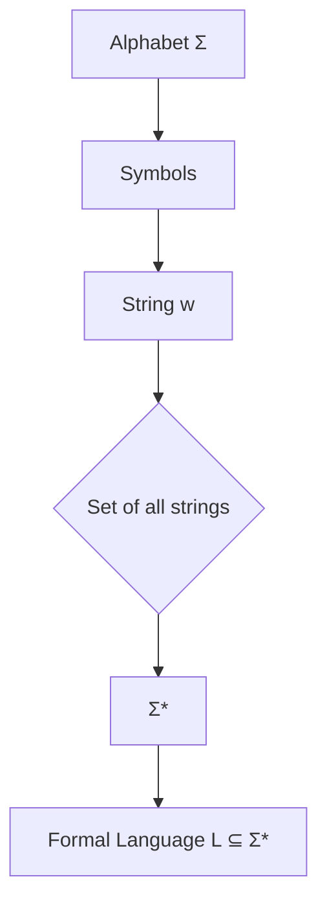
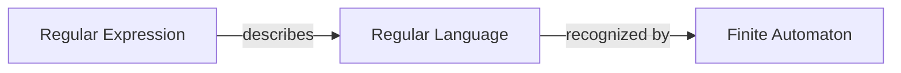
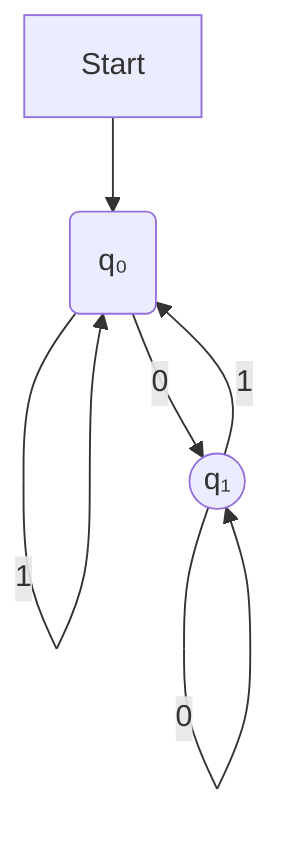

# Automata Theory and Formal Languages: Complete Study Notes

## 1. Formal Languages

### Alphabets, Strings, and Languages
- **Alphabet (Σ)**: A finite, non-empty set of symbols. For example, `Σ = {0, 1}` is the binary alphabet.
- **String (or Word)**: A finite sequence of symbols from an alphabet. `ε` denotes the **empty string**, which has a length of 0.
- **Σ***: The set of all possible strings that can be formed from the alphabet `Σ`, including the empty string.
- **Formal Language (L)**: Any subset of `Σ*`. It is a set of strings chosen from `Σ*`.



## 2. Regular Expressions (Regex)

### Definition
A **regular expression** is a sequence of characters that specifies a search pattern. It is a powerful tool for describing and matching strings in a formal language.

### Basic Operators
Let `R` and `S` be regular expressions. The fundamental operations are:
- **Concatenation (`RS`)**: A string that matches `R` followed by a string that matches `S`.
- **Union / Alternation (`R | S` or `R + S`)**: Matches either a string that matches `R` or a string that matches `S`.
- **Kleene Star (`R*`)**: Matches zero or more occurrences of strings that match `R`. This always includes the empty string `ε`.
- **Kleene Plus (`R+`)**: Matches one or more occurrences of strings that match `R`. `R+` is equivalent to `RR*`.

### Operator Precedence
1.  **Kleene Star/Plus** (`*`, `+`)
2.  **Concatenation**
3.  **Union** (`|`)
Parentheses `()` can be used to override the default precedence.

### Examples
- `1(0|1)*0`: Binary strings that start with `1` and end with `0`.
- `(ha)+`: Describes the language `{ha, haha, hahaha, ...}`.
- `b(a|i|oa)rd`: Describes the set of strings `{bard, bird, board}`.

## 3. Regular Languages

A language is called a **regular language** if there exists a regular expression that describes it. Regular languages are the simplest class of formal languages and can be recognized by finite automata.



## 4. Finite Automata (FA)

### Concept
A **finite automaton** (or finite state machine) is an abstract computational model. It is a machine that has a finite number of states and transitions between those states based on an input string. It either **accepts** or **rejects** the input.

### Deterministic Finite Automata (DFA)

A DFA is a 5-tuple `M = (Q, Σ, δ, q₀, F)` where:
- `Q`: A finite set of **states**.
- `Σ`: A finite set of input symbols (the **alphabet**).
- `δ`: The **transition function**, `δ: Q × Σ → Q`. For a given state and symbol, it returns a single next state.
- `q₀`: The **start state** (`q₀ ∈ Q`).
- `F`: A set of **accept (or final) states** (`F ⊆ Q`).

### How a DFA Works
1.  The machine starts in the start state `q₀`.
2.  It reads the input string one symbol at a time, from left to right.
3.  For each symbol, it transitions to a new state using the transition function `δ`.
4.  After the last symbol is read, if the machine is in an accept state (`F`), the string is **accepted**. Otherwise, it is **rejected**.

A key property of a DFA is that for any given state and input symbol, there is **exactly one** state to transition to.

### Example DFA
Let's design a DFA that accepts all binary strings ending in `0`.
- `Q = {q₀, q₁}`
- `Σ = {0, 1}`
- `q₀` is the start state.
- `F = {q₁}`
- `δ` is defined as:
  - `δ(q₀, 0) = q₁`
  - `δ(q₀, 1) = q₀`
  - `δ(q₁, 0) = q₁`
  - `δ(q₁, 1) = q₀`


This DFA accepts strings like `0`, `10`, `110`, `1010` but rejects strings like `1`, `101`, `111`.

## 5. The Chomsky Hierarchy

Formal languages are classified into a hierarchy of increasing complexity, known as the Chomsky Hierarchy. Regular languages, recognized by finite automata, form the simplest and most foundational level of this hierarchy.

```mermaid
graph TD
    subgraph Chomsky Hierarchy
        A(Type-3: Regular Languages)
        B(Type-2: Context-Free Languages)
        C(Type-1: Context-Sensitive Languages)
        D(Type-0: Recursively Enumerable Languages)
    end
    A --> B --> C --> D;

    subgraph Corresponding Automata
        E(Finite Automata)
        F(Pushdown Automata)
        G(Linear-Bounded Automata)
        H(Turing Machines)
    end
    A --- E;
    B --- F;
    C --- G;
    D --- H;
